------------------------------------------------------------------------

# Sitzung 1: Einführung, Organisatorisches und Grundlage

## Aus dem Modulhandbuch

Die Studierenden können Prozesse und Strukturen in der Informations- und Medienwirtschaft implementieren und Digital-Produkte entwickeln, indem sie

-   digitale Inhalte, Daten- und Medienprodukte sowie interaktive Darstellungsformen beispielsweise mit Methoden der User Experience konzipieren und realisieren,

-   um innovative Gestaltungsformate zu etablieren und damit Zielgruppen überprüfbar zu erreichen.

## Aus dem Modulhandbuch, continued

Die Studierenden können digitale Transformation verantwortungsbewusst und adressatengerecht gestalten, indem sie

-   Prozesse und Strukturen in der Informations- und Medienwirtschaft implementieren und digitale Produkte konzipieren und entwickeln;
-   Informationen, Inhalte und Datenbestände erschließen, kuratieren, aufbereiten, lizenzieren und publizieren;
-   Daten, digitale Medien und Technologien zielgruppenspezifisch vermitteln und kommunizieren.

## Kursziele

-   Rolle von Daten: Unterschied zwischen Daten, Informationen und Erkenntnissen verstehen und digitale Inhalte daran ausrichten.

-   Personalisierung und Empfehlung: Sie wenden einfache Segmentierungs‑ und Assoziationsverfahren an, um Inhalte zielgruppenspezifisch zu empfehlen.

-   Erfolgsüberprüfung: Sie definieren und überprüfen relevante KPIs

## Prüfungsleistung

-   Prüfungsleistung: 20‑minütiges Referat (mündliche Prüfung) und/oder 3–5‑seitiger Kurzbericht (schriftliche Prüfung): Segmentierung einer Zielgruppe auf Basis von Daten, Konzept eines Datenprodukts, Erfolgsdefinition und -Reportingkonzept.

## Logistik

-   Teilnahme online möglich, keine Aufzeichnung
-   Moodle Einschreibepasswort: CommanderData!
-   ChatGPT & Co sind ausdrücklich erlaubt, aber Sie müssen das Protokoll teilen

## Definitionen: Was sind digitale Inhalte, Daten- und Medienprodukte?

## Definitionen: Was sind "innovative Gestaltungsformate"?

## Was bedeutet "überprüfbar erreichen"?

## Was bedeutet...

-   "Prozesse und Strukturen in der Informations- und Medienwirtschaft implementieren und digitale Produkte konzipieren und entwickeln"?
-   "Informationen, Inhalte und Datenbestände erschließen, kuratieren, aufbereiten, lizenzieren und publizieren"?
-   "Daten, digitale Medien und Technologien zielgruppenspezifisch vermitteln und kommunizieren"?

## Was sind Daten überhaupt?

-   *Daten*
    -   Roh, ungeordnet, noch nicht interpretiert
    -   Bestehen aus Zahlen, Zeichen, Fakten ohne Kontext
-   *Informationen*
    -   Verarbeitete, kontextualisierte Daten
    -   Haben Bedeutung und Relevanz für eine Fragestellung
    -   **Daten + Kontext = Information**

## Datenkompetenz nach Ridsdale et al

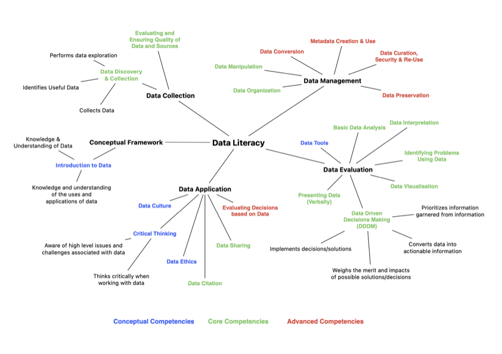

## DIKW-Pyramide

## Toms Pyramide

## Relevanz in der Aufmerksamkeitsökonomie

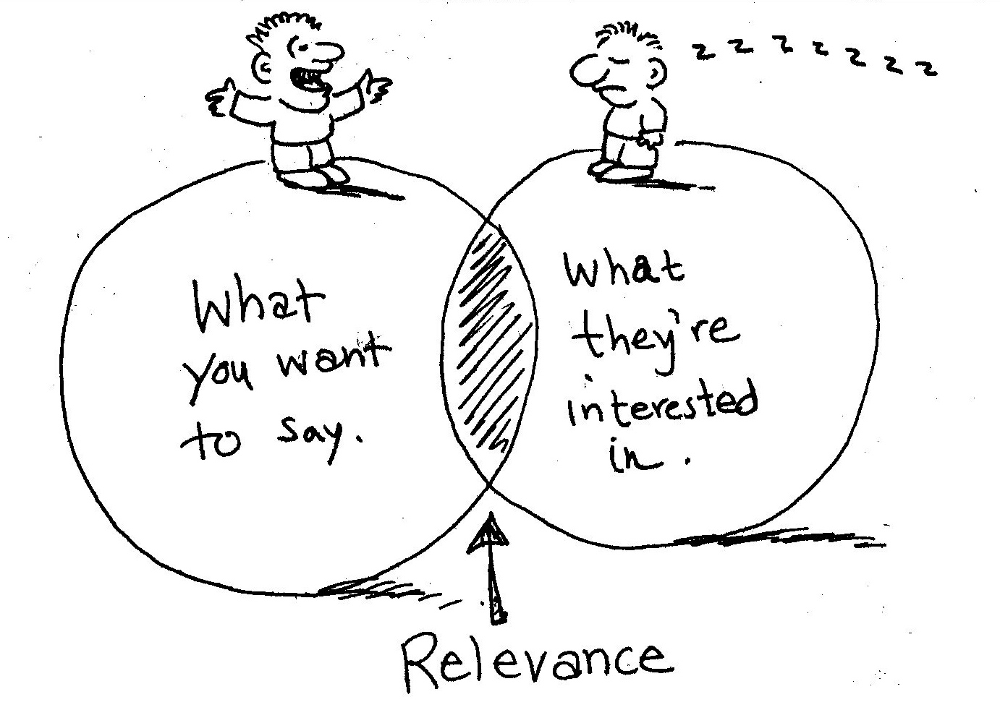

## Wie können wir Daten nutzen, um Relevanz zu erzeugen?

-   **Aufmerksamkeit als knappes Gut**: In der „Attention Economy“ zahlen Nutzer\*innen mit ihrer Aufmerksamkeit; Informationsüberflutung erfordert filternde Mechanismen.

-   **Data Mining als Brücke**: Data Mining extrahiert Muster und Korrelationen aus großen Datenmengen, um relevante Informationen zu erzeugen.

## Beispiel: Newsletter

-   Was ist das Ziel/sind die Ziele eines Newsletters?
-   Was sind mögliche KPIs?

------------------------------------------------------------------------

## Wie funktioniert Data Mining?

------------------------------------------------------------------------

## Data Mining-Sprachen und -Systeme

-   SPSS / PSPP
-   SAS
-   Python
-   Scala
-   Julia
-   R
-   Knime
-   ...

## Welche Inhalte wünschen Sie sich noch?

------------------------------------------------------------------------

## Nächste Schritte

-   Überlegen Sie sich ein Thema für ein digitales Produkt
-   Identifizieren Sie Daten, die die Zielgruppe definieren

------------------------------------------------------------------------

# Sitzung 2: Daten-Akquise und -Überprüfung

## Datenquellen: Primärdaten

-   Interviews
-   Umfragen
-   Experimente / Messungen
-   Tracking (eigene Tools oder Tools Dritter)

------------------------------------------------------------------------

## Datenquellen: Sekundärdaten

-   Statistisches Bundesamt
-   GfK, Brandindex, Statista
-   Open-Data-Portale
-   Google-Tools

------------------------------------------------------------------------

## Fragen zur Datenqualität

-   Wer hat die Daten erhoben?
-   Zu welchem Zweck?
-   Ist die Stichprobe repräsentativ?
-   Sind die Variablen klar definiert?
-   Sind die Befragten voreingenommen?
-   Wie zuverlässig (reliabel) und gültig (valide) sind die Messungen?

------------------------------------------------------------------------

## Reliabilität & Validität

**Reliabilität**\
- Misst das Instrument konsistent?\
- Beispiel: Wiederholte Befragung führt zu ähnlichen Ergebnissen.

**Validität**\
- Misst das Instrument, was es messen soll?\
- Beispiel: „Zufriedenheit“ darf nicht nur mit „Häufigkeit der Nutzung“ gleichgesetzt werden.

------------------------------------------------------------------------

## Häufige Probleme bei Stichproben

-   **Convenience Sampling:** Auswahl der Personen, die leicht erreichbar sind – aber nicht repräsentativ.
-   **Non-Response-Bias:** Bestimmte Gruppen nehmen systematisch nicht teil.
-   **Kulturelle Antwortverzerrung:** Ein „Nein“ ist in manchen Kulturen sozial unerwünscht.
-   **Soziale Erwünschtheit:** Menschen geben Antworten, die gut klingen – nicht unbedingt die Wahrheit.

------------------------------------------------------------------------

## Website-Umfrage

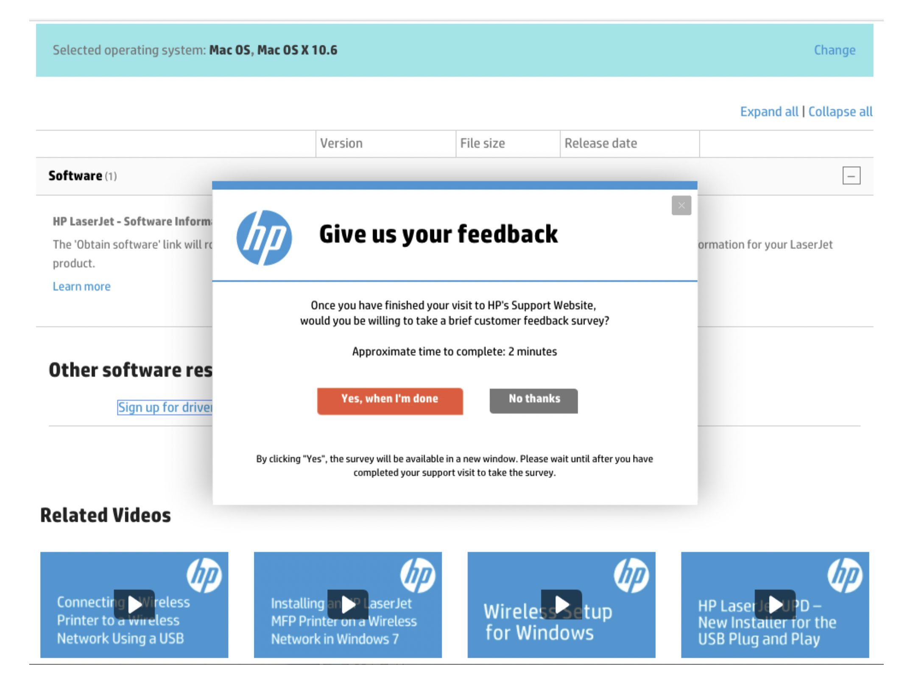

------------------------------------------------------------------------

## Umfrage vor Weiterleitung

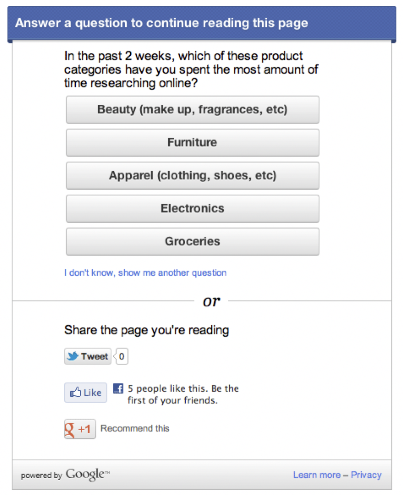

------------------------------------------------------------------------

## Soziale Erwünschtheit

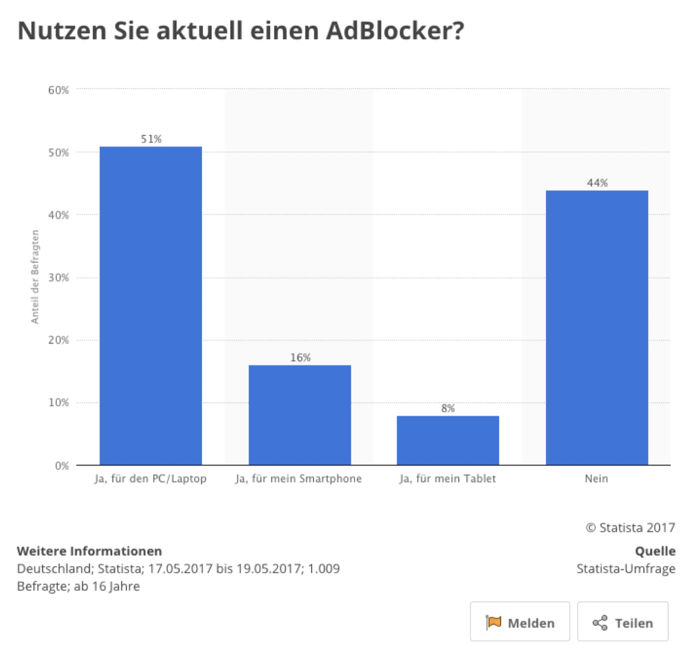

------------------------------------------------------------------------

## Glauben Sie das?

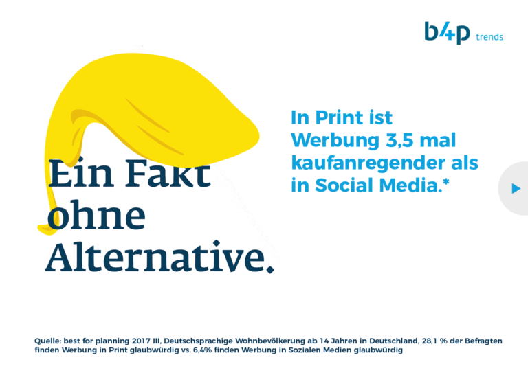

------------------------------------------------------------------------

## Wie waren die Fragen eigentlich gestellt?

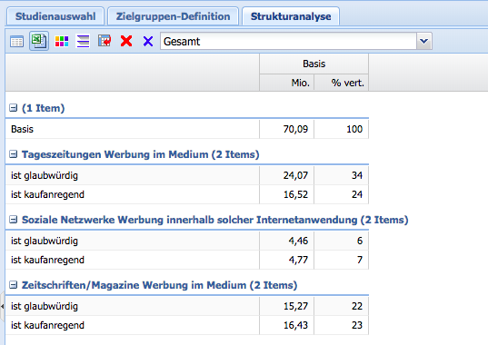

------------------------------------------------------------------------

## Wie kommt es zu dem Ergebnis?

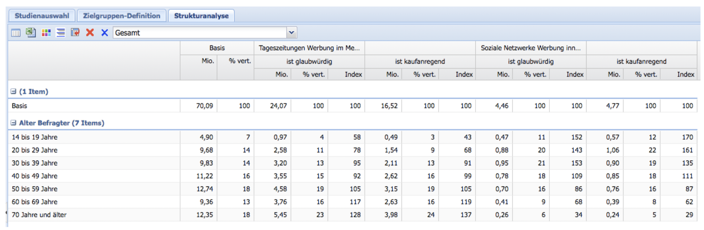

------------------------------------------------------------------------

## Beispiele für Umfrageverzerrungen

| Bias                 | Beschreibung                         |
|----------------------|--------------------------------------|
| Yes Bias             | Tendenz, Aussagen zuzustimmen        |
| No Bias              | Tendenz, Aussagen abzulehnen         |
| Middle Bias          | Auswahl neutraler Antwortoptionen    |
| Logical Response     | Überrationalisiertes Antworten       |
| Convenience Sampling | Auswahl leicht erreichbarer Personen |

------------------------------------------------------------------------

## Weitere typische Verzerrungen

-   **Recall Bias:** Falsche Erinnerung bei retrospektiven Fragen.
-   **Survivorship Bias:** Nur „Überlebende“ werden betrachtet, z. B. erfolgreiche Start-ups.
-   **Algorithmic Bias:** Verzerrte Trainingsdaten führen zu unfairen Modellen.
-   **Availability Bias:** Häufig Gehörtes wird überschätzt.
-   **Confirmation Bias:** Suche nach bestätigenden Informationen.

------------------------------------------------------------------------

## Der Bestätigungsfehler (Confirmation Bias)

Wir suchen bevorzugt nach Daten, die unsere Meinung **bestätigen**.

-   Widersprüchliche Daten werden ignoriert
-   Unterstützende Daten werden überbewertet
-   „Cherry Picking“ bei der Datenauswahl

**Das größte Risiko für Verzerrung sind wir selbst.**

------------------------------------------------------------------------

## Survivorship Bias

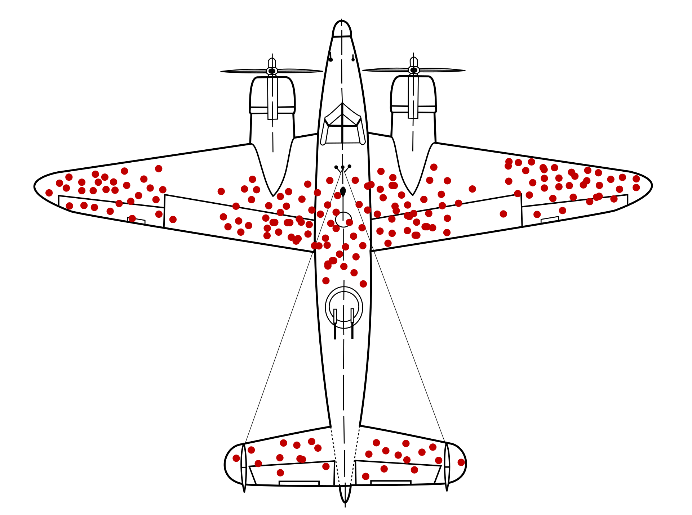

## Survivorship Bias

-   (Verzerrung zugunsten der Überlebenden)
-   Wir sehen nur die „Überlebenden“ – also erfolgreiche Fälle
-   Gescheiterte Beispiele fehlen in den Daten
-   Führt zu falschen Schlussfolgerungen über Erfolg

*Beispiel:* Analyse erfolgreicher Start-ups ohne Berücksichtigung der gescheiterten.

------------------------------------------------------------------------

## Stichprobenverzerrung

------------------------------------------------------------------------

## Stichprobenverzerrung

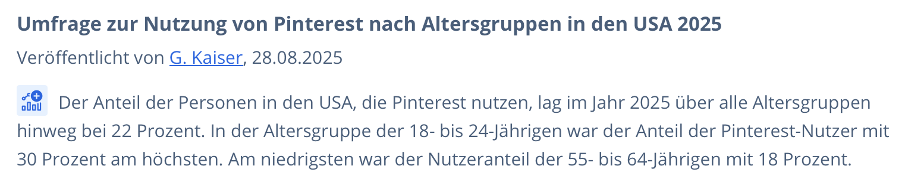

------------------------------------------------------------------------

## Fallbeispiel: Der Fehler der *Literary Digest*-Umfrage (1936)

-   Befragte Leser, Auto- und Telefonbesitzer
-   Ergebnis: Landon gewinnt gegen Roosevelt
-   Realität: Roosevelt siegte deutlich
-   Ursache: **Selection Bias** – wohlhabende Befragte waren überrepräsentiert

------------------------------------------------------------------------

## Stichprobenverzerrung

-   Systematische Abweichung durch fehlerhafte Auswahl
-   Auch große Stichproben helfen nicht, wenn sie nicht zufällig sind
-   Beispiel: Online-Umfragen erreichen nur digital affine Personen

------------------------------------------------------------------------

## Gegenmaßnahmen

-   Kritische Prüfung von Datenquellen und Methoden
-   Kombination mehrerer Quellen (Triangulation)
-   Dokumentation der Stichprobenverfahren
-   Qualitative Validierung der Ergebnisse
-   Randomisierung oder Stratifizierung
-   Sensitivitätsanalyse: Wie stabil sind Ergebnisse bei Annahmeänderungen?
-   Bewusstsein für eigene kognitiven Verzerrungen

------------------------------------------------------------------------

## Stratifizierung

**Definition:**\
Unterteilung der Grundgesamtheit in **Teilgruppen (Strata)** mit ähnlichen Merkmalen, bevor daraus zufällig gezogen wird.

**Beispiel:**\
Bei einer Umfrage in Deutschland werden die Teilnehmenden zunächst nach Geschlecht (m / w / d), Altersgruppen (18–29, 30–49, 50+), Region (Nord, Süd, Ost, West)\
eingeteilt. Anschließend erfolgt die Zufallsauswahl **innerhalb jedes Stratum**.

------------------------------------------------------------------------

## Nächste Schritte

-   Überlegen Sie sich ein Thema für ein digitales Produkt
-   Identifizieren Sie Daten, die die Zielgruppe definieren

------------------------------------------------------------------------

# Sitzung 3: Lean Content Strategy Canvas

## Bitte beachten Sie die Templates im Moodle

------------------------------------------------------------------------

# Sitzung 4: Besprechung Canvases

## Review der Canvases aus Session 3

------------------------------------------------------------------------

# Sitzung 5: Wie kommen Nutzer zu meinen Inhalten?

------------------------------------------------------------------------

## Wie finden Nutzer meine Inhalte?

-   ...

------------------------------------------------------------------------

## Push vs. Pull

-   Teilen Sie Ihnen bekannte Kanäle ein!

------------------------------------------------------------------------

## Owned / Earned / Paid Media

-   Owned = du kontrollierst es
-   Earned = andere reden über dich
-   Paid = du kaufst dir Aufmerksamkeit

------------------------------------------------------------------------

## Wie wird man Influencer? (aus letzter Session)

-   Rage Bait / Click Bait
-   Community durch USP
-   Regelmäßige Posts, jeden Tag, verschiedene Formate, mehrere Plattformen
-   Stringenz im Content, Spezialisierung
-   Shitstorms

------------------------------------------------------------------------

## Inhalte als Lead-Magnet

-   „Was bekomme ich, wenn ich Ihnen meine Aufmerksamkeit (oder E-Mail) gebe?“
-   Typische Lead-Magneten: Whitepaper, Checklisten, Tools, exklusive Dashboards.
-   Verbindung zu Content Value Proposition?

------------------------------------------------------------------------

## Das LIFT-Modell

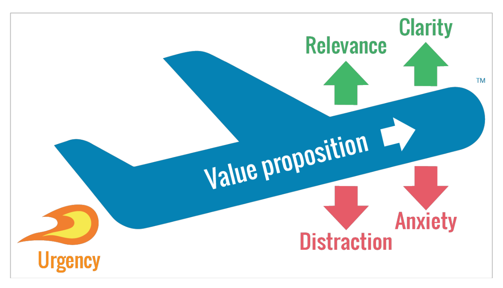

------------------------------------------------------------------------

## Die neue Herausforderung: AEO & GEO

-   SEO: Search Engine Optimization
-   AEO: Answer Engine Optimization
-   GEO: Generative Engine Optimization

------------------------------------------------------------------------

## Der Alligator

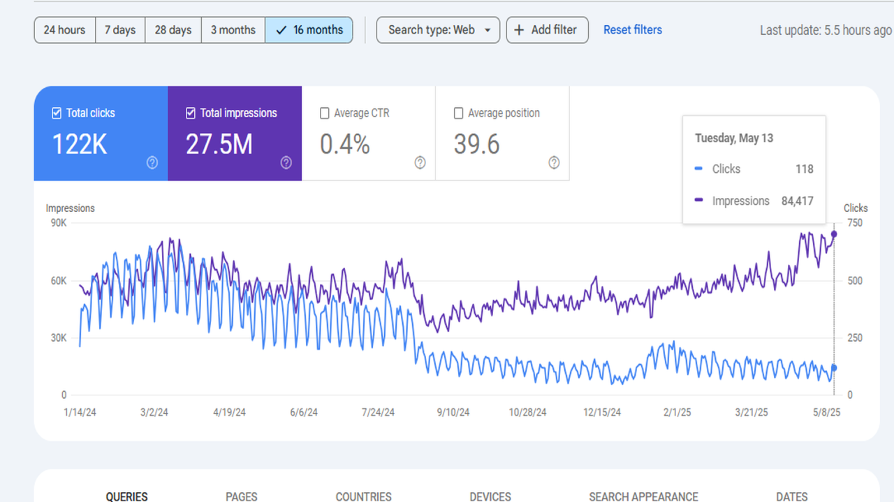

## Real Estate geht verloren

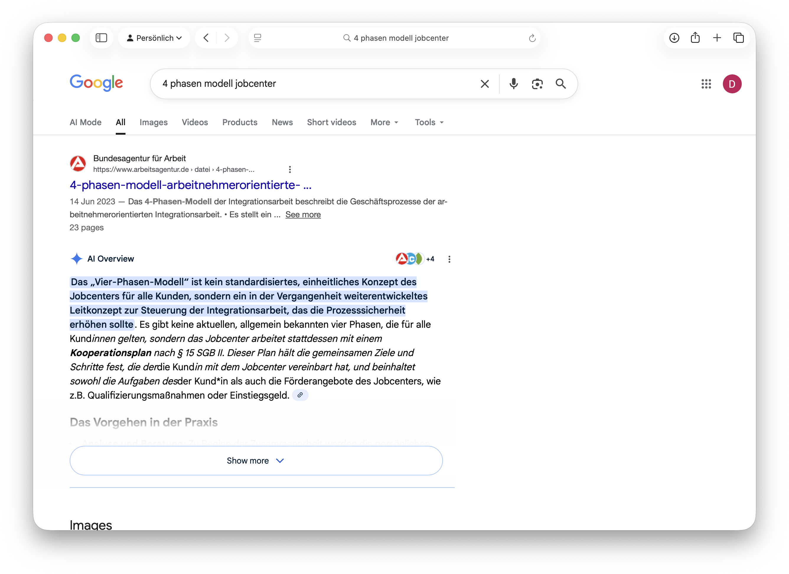

------------------------------------------------------------------------

## Real Estate geht verloren

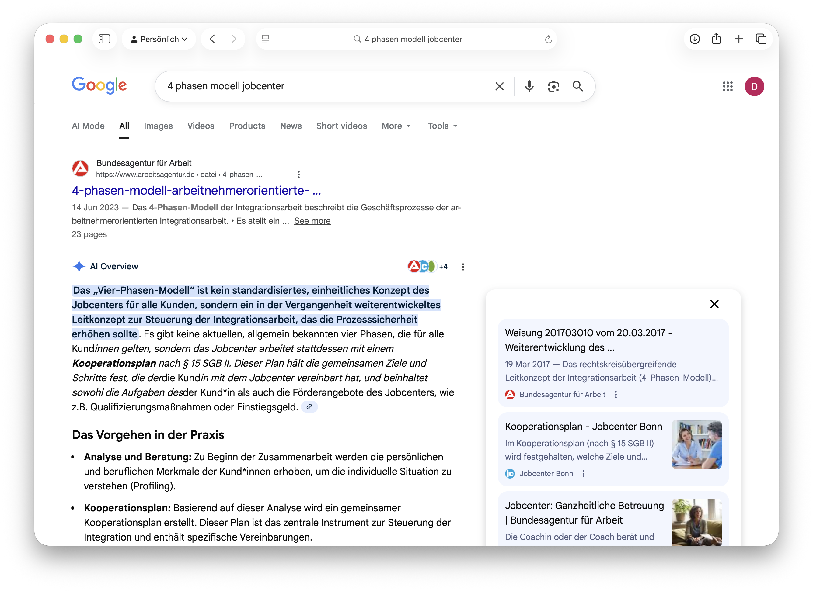

------------------------------------------------------------------------

## Real Estate geht verloren

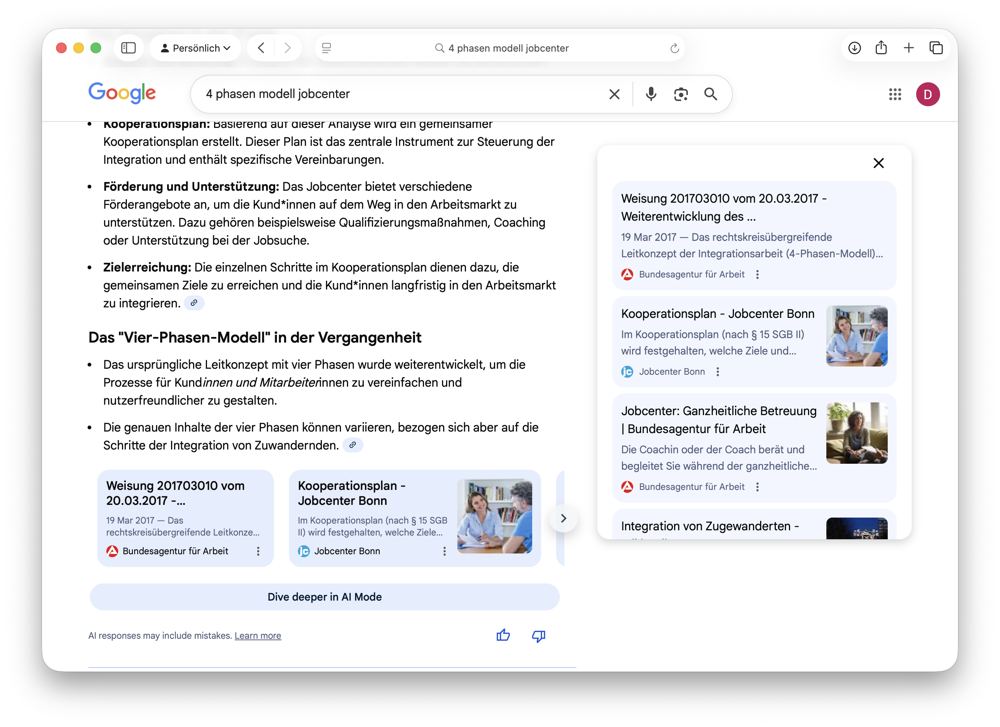

------------------------------------------------------------------------

## Real Estate geht verloren

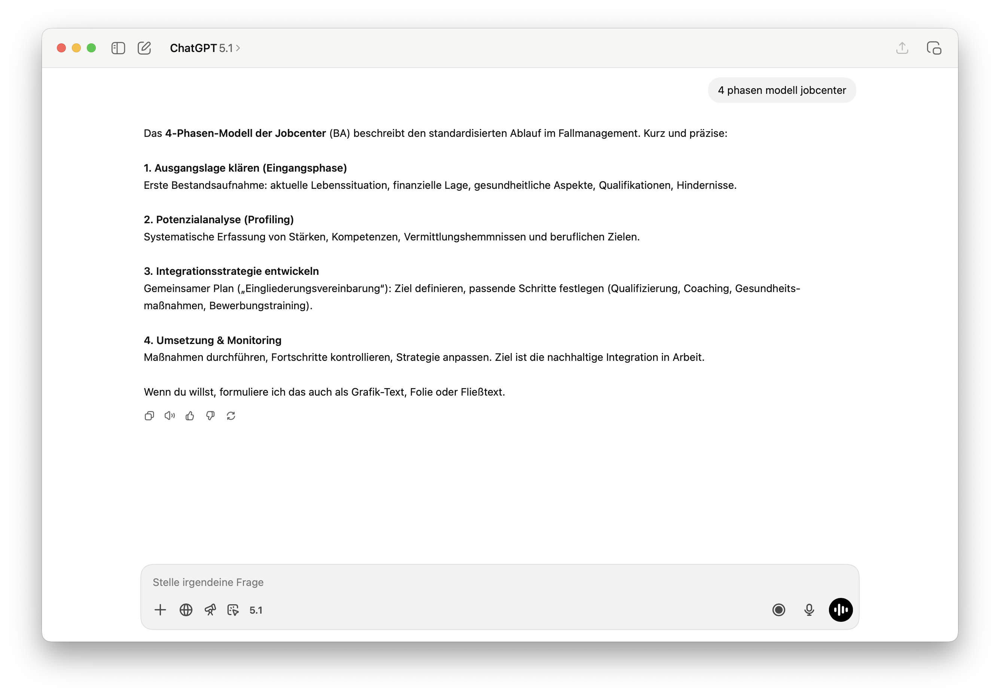

------------------------------------------------------------------------

## Real Estate geht verloren

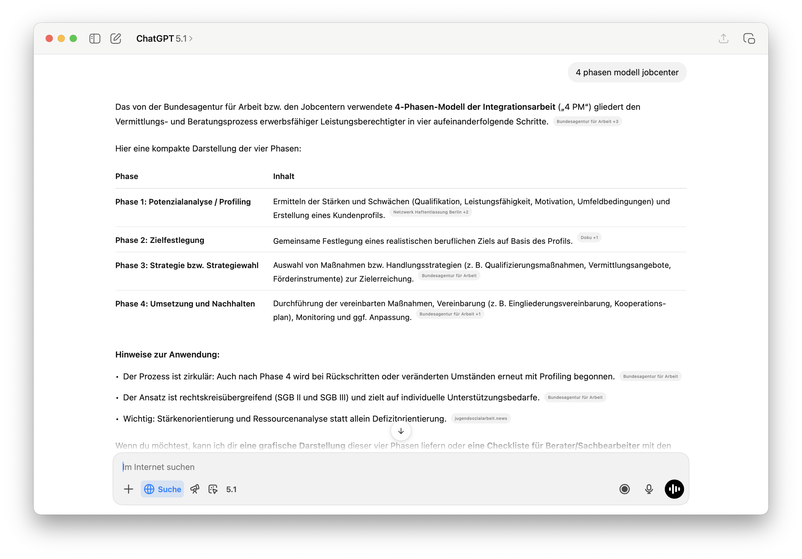

------------------------------------------------------------------------

## Nutzerverhalten 2024–2025

-   Große Verschiebung bei den Jüngeren: ChatGPT, TikTok und Instagram für Suche
-   Claneo-Studie 2025:
    -   **KI-Chatbots**: Nutzung 18 % (2024) → 33 % (2025)
    -   **KI-Suchmaschinen** (Perplexity etc.) 14 % → 17 %
    -   **Klassische Suchmaschinen** sinken leicht, bleiben aber dominant.\

------------------------------------------------------------------------

## Diskussion: Wo liegt meine Audience?

------------------------------------------------------------------------

## Nächste Schritte

-   Bitte überarbeiten Sie Ihre Canvases in Bezug auf die Kanäle

# Sitzung 6: Erfolgsmessung

------------------------------------------------------------------------

## Warum Erfolgsmessung?

-   Ohne klare Ziele sind Metriken bedeutungslos
-   Wie zahlt eine Website/App auf das Businessziel ein?

------------------------------------------------------------------------

## Ziele (Business Outcomes)

-   Mehr Leads
-   Mehr Anmeldungen
-   Mehr aktive Nutzer (Werbeeinblendungen)
-   Mehr Abschlüsse / Käufe

------------------------------------------------------------------------

## Conversions (Content-Abschlüsse)

-   Newsletter-Anmeldung
-   PDF-Download
-   Formularabschluss
-   Video bis 75 % (falls Hauptzweck)

------------------------------------------------------------------------

## Micro-Conversions (Frühindikatoren)

-   Scrolltiefe
-   Element Visibility
-   Formularstart
-   Klicks auf Module (Tabs, Slider, Quiz)
-   Copy-to-Clipboard
-   Video-Start oder 25 % Fortschritt

------------------------------------------------------------------------

## Keine guten KPIs

-   Zeit auf Seite / Engaged Sessions
-   Seiten/Sitzung

------------------------------------------------------------------------

## Scrolltiefe

-   Erfasst, wie weit Nutzer tatsächlich auf einer Seite nach unten gelangen
-   Geringe Scrolltiefe + hohe Absprungrate → falsches Thema oder schwacher Einstieg
-   Hohe Scrolltiefe + wenige Conversions → Interesse vorhanden, CTA/Angebot zu schwach

------------------------------------------------------------------------

## Element Visibility

-   Misst, ob ein Element im **Viewport** sichtbar war
-   Relevante Elemente: CTA, Download-Box, Formular, Produkt-Highlights

**Nutzen:**\
- Sichtbarkeit ≠ Klicks\
- Beispiel: „CTA wurde von 42 % gesehen, aber nur 3 % klickten“ → klare Optimierungsrichtung

------------------------------------------------------------------------

## Tools: Matomo

**Matomo**\
- Datensouveränität, DSGVO-freundlich\
- On-Premise möglich\
- Transparentes Event-Tracking\
- Klassisches Webanalyse-Modell - Demo

## Tools: Google Analytics

**Google Analytics (GA4)**\
- Ereignisbasiertes Datenmodell\
- Automatische Events (Scrolls, Engagement, Outbound) - Kann auch Apps und Cross-Device Tracking - Moderne Metriken (Engaged Sessions, Predictive Signals)\
- Demo

------------------------------------------------------------------------

## KPIs: Reichweite

-   Unique Users
-   Daily / Weekly / Monthly Active Users (DAU/WAU/MAU)
-   Installs / First Opens (App)
-   Traffic-Quellen
-   Returning Visitor/User Rate
-   Visibility in AEO/GEO (AI Overviews, Chatbot-Responses)

------------------------------------------------------------------------

## KPIs: Engagement

-   Session Frequency (Sessions/User/Tag oder Woche)
-   Average Session Duration
-   Screens per Session (App)
-   Scrolltiefe (Web)
-   Element Visibility (Web)
-   Video-Metriken: Play Rate, Watch Time, Completion
-   Feature Usage (App)
-   In-App Events (z. B. „Added to Favourites“, „Completed Task“)

------------------------------------------------------------------------

## KPIs: Interaktion (Micro-Conversions)

-   CTA-Klicks
-   Downloads (PDF, Asset, Datei)
-   Formularstarts / Abbrüche
-   Copy-to-Clipboard
-   Onboarding Completion (App)
-   Push-Notification Opt-in / Interaktion
-   Deep-Link Events

------------------------------------------------------------------------

## KPIs: Conversion

-   Registrierungen
-   Abschlüsse / Purchases
-   Conversion Rate pro Funnel-Schritt
-   Assisted Conversions (Multi-Touch)
-   Upgrade Rate (Free → Paid, App)
-   In-App Purchase Rate

------------------------------------------------------------------------

## KPIs: Qualität & Stabilität (App)

-   Crash Rate
-   Error Events
-   App Start Time
-   Load Time / Latency
-   Failed Transactions
-   Rage Clicks / Dead Clicks (optional, Web & App)

------------------------------------------------------------------------

## KPIs: Bindung & Churn

-   Retention (Day 1 / Day 7 / Day 30)
-   Cohort Retention
-   Churn Rate
-   Re-Activation Rate
-   Push Notification Re-Engagement

## KPI vs. Ziel: Was ist der Unterschied?

**Ziel**\
- Beschreibt *was* erreicht werden soll\
- Ergebnisorientiert\
- Beispiel: „Mehr Registrierungen für meinen Kurs“

**KPI**\
- Beschreibt *wie gut* wir auf dem Weg zum Ziel sind\
- Messgröße, nicht das Ziel selbst\
- Beispiel: „Conversion Rate der Registrierungsseite“

**Kurzform:**\
Ziele definieren die Richtung – KPIs messen den Fortschritt.

------------------------------------------------------------------------

## Beispiele für Ziele und passende KPIs

**Ziel:** Mehr aktive Nutzer\
**KPI:** Daily/Weekly Active Users (DAU/WAU)

**Ziel:** Mehr Leads\
**KPI:** Formular-Conversion-Rate

**Ziel:** Bessere Content-Performance\
**KPI:** Scrolltiefe, Sichtbarkeit, Interaktionsraten

**Ziel:** Höhere Nutzerbindung\
**KPI:** 7-Tage-Retention, Churn Rate

## KPIs für Artikel / Blogposts

-   Scrolltiefe
-   Element Visibility (v. a. CTA / Weiterführende Links)
-   SERP-Klickrate
-   Returning Visitor Rate
-   Shares / Saves

------------------------------------------------------------------------

## KPIs für Videos

-   Play Rate
-   Average Watch Time
-   Completion Rate
-   Drop-off Points
-   CTA-Klick nach Videoende

------------------------------------------------------------------------

## KPIs für PDFs / Whitepaper / Downloads

-   Formularstart
-   Formularabschluss
-   Download Rate
-   Assisted Conversions
-   Sichtbarkeit der Download-Box (Element Visibility)

------------------------------------------------------------------------

## KPIs für interaktive Inhalte (Quiz, Tools, Rechner)

-   Task Success Rate
-   Feature Usage
-   Interaktionen (Tabs, Buttons, Module)
-   Conversion nach Nutzung
-   Time on Task

------------------------------------------------------------------------

## KPIs für App-Features

-   DAU/WAU
-   Feature Usage Events
-   Onboarding Completion
-   Retention (Day 1 / 7 / 30)
-   Churn Rate

------------------------------------------------------------------------

## KPIs für Newsletter / E-Mails

-   Open Rate
-   Click Rate
-   Unsubscribe Rate
-   Conversion Rate (z. B. Download, Anmeldung)
-   Deep-Link Engagement

------------------------------------------------------------------------

## Fallstricke bei der Interpretation

-   „Mehr Traffic“ ist kein sinnvolles Ziel
-   Verweildauer kann sowohl positive als auch negative Gründe haben
-   Scrolltiefe ≠ qualitatives Lesen
-   Event-Implementierung muss sauber sein (Schwellen, Debounce, Deduplikation)
-   Attribution beeinflusst Ergebnisse stärker als erwartet
-   Kleine Stichproben \>\> keine belastbaren Schlüsse

------------------------------------------------------------------------

## Machine Learning-Modell auf Basis von Scrolltiefe

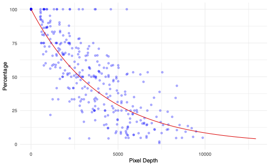

## Machine Learning-Modell auf Basis von Scrolltiefe

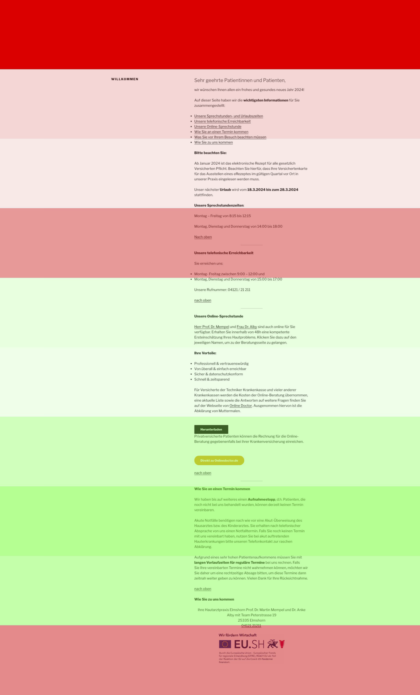

------------------------------------------------------------------------

## Übung

**Für Ihre eigenen digitalen Inhalte:**\
1 Outcome\
2 Conversions\
3 Micro-Conversions definieren

# Sitzung 7: A/B Testing

------------------------------------------------------------------------

# Sitzung 8: Data Mining

## Was ist Data Mining?

## Warum Data Mining?

## Assoziationsanalyse

## Naive Bayes

------------------------------------------------------------------------

# Sitzung 9: Datenvisualisierung

------------------------------------------------------------------------

# Sitzung 10:

------------------------------------------------------------------------

# Sitzung 11:

------------------------------------------------------------------------

# Sitzung 12:

------------------------------------------------------------------------

# Sitzung 13:

------------------------------------------------------------------------
