------------------------------------------------------------------------

# Sitzung 1: Einführung, Organisatorisches und Grundlage

## Aus dem Modulhandbuch

Die Studierenden können Prozesse und Strukturen in der Informations- und Medienwirtschaft implementieren und Digital-Produkte entwickeln, indem sie

-   digitale Inhalte, Daten- und Medienprodukte sowie interaktive Darstellungsformen beispielsweise mit Methoden der User Experience konzipieren und realisieren,

-   um innovative Gestaltungsformate zu etablieren und damit Zielgruppen überprüfbar zu erreichen.

## Aus dem Modulhandbuch, continued

Die Studierenden können digitale Transformation verantwortungsbewusst und adressatengerecht gestalten, indem sie

-   Prozesse und Strukturen in der Informations- und Medienwirtschaft implementieren und digitale Produkte konzipieren und entwickeln;
-   Informationen, Inhalte und Datenbestände erschließen, kuratieren, aufbereiten, lizenzieren und publizieren;
-   Daten, digitale Medien und Technologien zielgruppenspezifisch vermitteln und kommunizieren.

## Kursziele

-   Rolle von Daten: Unterschied zwischen Daten, Informationen und Erkenntnissen verstehen und digitale Inhalte daran ausrichten.

-   Personalisierung und Empfehlung: Sie wenden einfache Segmentierungs‑ und Assoziationsverfahren an, um Inhalte zielgruppenspezifisch zu empfehlen.

-   Erfolgsüberprüfung: Sie definieren und überprüfen relevante KPIs

## Prüfungsleistung

-   Prüfungsleistung: 20‑minütiges Referat (mündliche Prüfung) und/oder 3–5‑seitiger Kurzbericht (schriftliche Prüfung): Segmentierung einer Zielgruppe auf Basis von Daten, Konzept eines Datenprodukts, Erfolgsdefinition und -Reportingkonzept.

## Logistik

-   Teilnahme online möglich, keine Aufzeichnung
-   Moodle Einschreibepasswort: CommanderData!
-   ChatGPT & Co sind ausdrücklich erlaubt, aber Sie müssen das Protokoll teilen

## Definitionen: Was sind digitale Inhalte, Daten- und Medienprodukte?

## Definitionen: Was sind "innovative Gestaltungsformate"?

## Was bedeutet "überprüfbar erreichen"?

## Was bedeutet...

-   "Prozesse und Strukturen in der Informations- und Medienwirtschaft implementieren und digitale Produkte konzipieren und entwickeln"?
-   "Informationen, Inhalte und Datenbestände erschließen, kuratieren, aufbereiten, lizenzieren und publizieren"?
-   "Daten, digitale Medien und Technologien zielgruppenspezifisch vermitteln und kommunizieren"?

## Was sind Daten überhaupt?

-   *Daten*
    -   Roh, ungeordnet, noch nicht interpretiert
    -   Bestehen aus Zahlen, Zeichen, Fakten ohne Kontext
-   *Informationen*
    -   Verarbeitete, kontextualisierte Daten
    -   Haben Bedeutung und Relevanz für eine Fragestellung
    -   **Daten + Kontext = Information**

## Datenkompetenz nach Ridsdale et al


## DIKW-Pyramide


## Toms Pyramide


## Relevanz in der Aufmerksamkeitsökonomie


## Wie können wir Daten nutzen, um Relevanz zu erzeugen?

-   **Aufmerksamkeit als knappes Gut**: In der „Attention Economy“ zahlen Nutzer\*innen mit ihrer Aufmerksamkeit; Informationsüberflutung erfordert filternde Mechanismen.

-   **Data Mining als Brücke**: Data Mining extrahiert Muster und Korrelationen aus großen Datenmengen, um relevante Informationen zu erzeugen.

## Beispiel: Newsletter

-   Was ist das Ziel/sind die Ziele eines Newsletters?
-   Was sind mögliche KPIs?

------------------------------------------------------------------------

## Wie funktioniert Data Mining?


------------------------------------------------------------------------

## Data Mining-Sprachen und -Systeme

-   SPSS / PSPP
-   SAS
-   Python
-   Scala
-   Julia
-   R
-   Knime
-   ...

## Welche Inhalte wünschen Sie sich noch?

------------------------------------------------------------------------

## Nächste Schritte

-   Überlegen Sie sich ein Thema für ein digitales Produkt
-   Identifizieren Sie Daten, die die Zielgruppe definieren

------------------------------------------------------------------------

# Sitzung 2: Daten-Akquise und -Überprüfung

## Datenquellen: Primärdaten

-   Interviews
-   Umfragen
-   Experimente / Messungen
-   Tracking (eigene Tools oder Tools Dritter)

------------------------------------------------------------------------

## Datenquellen: Sekundärdaten

-   Statistisches Bundesamt
-   GfK, Brandindex, Statista
-   Open-Data-Portale
-   Google-Tools

------------------------------------------------------------------------

## Fragen zur Datenqualität

-   Wer hat die Daten erhoben?
-   Zu welchem Zweck?
-   Ist die Stichprobe repräsentativ?
-   Sind die Variablen klar definiert?
-   Sind die Befragten voreingenommen?
-   Wie zuverlässig (reliabel) und gültig (valide) sind die Messungen?

------------------------------------------------------------------------

## Reliabilität & Validität

**Reliabilität**\
- Misst das Instrument konsistent?\
- Beispiel: Wiederholte Befragung führt zu ähnlichen Ergebnissen.

**Validität**\
- Misst das Instrument, was es messen soll?\
- Beispiel: „Zufriedenheit“ darf nicht nur mit „Häufigkeit der Nutzung“ gleichgesetzt werden.

------------------------------------------------------------------------

## Häufige Probleme bei Stichproben

-   **Convenience Sampling:** Auswahl der Personen, die leicht erreichbar sind – aber nicht repräsentativ.
-   **Non-Response-Bias:** Bestimmte Gruppen nehmen systematisch nicht teil.
-   **Kulturelle Antwortverzerrung:** Ein „Nein“ ist in manchen Kulturen sozial unerwünscht.
-   **Soziale Erwünschtheit:** Menschen geben Antworten, die gut klingen – nicht unbedingt die Wahrheit.

------------------------------------------------------------------------

## Website-Umfrage


------------------------------------------------------------------------

## Umfrage vor Weiterleitung


------------------------------------------------------------------------

## Soziale Erwünschtheit


------------------------------------------------------------------------

## Glauben Sie das?


------------------------------------------------------------------------

## Wie waren die Fragen eigentlich gestellt?


------------------------------------------------------------------------

## Wie kommt es zu dem Ergebnis?


------------------------------------------------------------------------

## Beispiele für Umfrageverzerrungen

| Bias                 | Beschreibung                         |
|----------------------|--------------------------------------|
| Yes Bias             | Tendenz, Aussagen zuzustimmen        |
| No Bias              | Tendenz, Aussagen abzulehnen         |
| Middle Bias          | Auswahl neutraler Antwortoptionen    |
| Logical Response     | Überrationalisiertes Antworten       |
| Convenience Sampling | Auswahl leicht erreichbarer Personen |

------------------------------------------------------------------------

## Weitere typische Verzerrungen

-   **Recall Bias:** Falsche Erinnerung bei retrospektiven Fragen.
-   **Survivorship Bias:** Nur „Überlebende“ werden betrachtet, z. B. erfolgreiche Start-ups.
-   **Algorithmic Bias:** Verzerrte Trainingsdaten führen zu unfairen Modellen.
-   **Availability Bias:** Häufig Gehörtes wird überschätzt.
-   **Confirmation Bias:** Suche nach bestätigenden Informationen.

------------------------------------------------------------------------

## Der Bestätigungsfehler (Confirmation Bias)

Wir suchen bevorzugt nach Daten, die unsere Meinung **bestätigen**.

-   Widersprüchliche Daten werden ignoriert
-   Unterstützende Daten werden überbewertet
-   „Cherry Picking“ bei der Datenauswahl

**Das größte Risiko für Verzerrung sind wir selbst.**

------------------------------------------------------------------------

## Survivorship Bias


## Survivorship Bias

-   (Verzerrung zugunsten der Überlebenden)
-   Wir sehen nur die „Überlebenden“ – also erfolgreiche Fälle
-   Gescheiterte Beispiele fehlen in den Daten
-   Führt zu falschen Schlussfolgerungen über Erfolg

*Beispiel:* Analyse erfolgreicher Start-ups ohne Berücksichtigung der gescheiterten.

------------------------------------------------------------------------

## Stichprobenverzerrung


------------------------------------------------------------------------

## Stichprobenverzerrung


------------------------------------------------------------------------

## Fallbeispiel: Der Fehler der *Literary Digest*-Umfrage (1936)

-   Befragte Leser, Auto- und Telefonbesitzer
-   Ergebnis: Landon gewinnt gegen Roosevelt
-   Realität: Roosevelt siegte deutlich
-   Ursache: **Selection Bias** – wohlhabende Befragte waren überrepräsentiert

------------------------------------------------------------------------

## Stichprobenverzerrung

-   Systematische Abweichung durch fehlerhafte Auswahl
-   Auch große Stichproben helfen nicht, wenn sie nicht zufällig sind
-   Beispiel: Online-Umfragen erreichen nur digital affine Personen

------------------------------------------------------------------------

## Gegenmaßnahmen

-   Kritische Prüfung von Datenquellen und Methoden
-   Kombination mehrerer Quellen (Triangulation)
-   Dokumentation der Stichprobenverfahren
-   Qualitative Validierung der Ergebnisse
-   Randomisierung oder Stratifizierung
-   Sensitivitätsanalyse: Wie stabil sind Ergebnisse bei Annahmeänderungen?
-   Bewusstsein für eigene kognitiven Verzerrungen

------------------------------------------------------------------------

## Stratifizierung

**Definition:**\
Unterteilung der Grundgesamtheit in **Teilgruppen (Strata)** mit ähnlichen Merkmalen, bevor daraus zufällig gezogen wird.

**Beispiel:**\
Bei einer Umfrage in Deutschland werden die Teilnehmenden zunächst nach Geschlecht (m / w / d), Altersgruppen (18–29, 30–49, 50+), Region (Nord, Süd, Ost, West)\
eingeteilt. Anschließend erfolgt die Zufallsauswahl **innerhalb jedes Stratum**.

------------------------------------------------------------------------

## Nächste Schritte

-   Überlegen Sie sich ein Thema für ein digitales Produkt
-   Identifizieren Sie Daten, die die Zielgruppe definieren

------------------------------------------------------------------------

# Sitzung 3: Lean Content Strategy Canvas

## Bitte beachten Sie die Templates im Moodle

------------------------------------------------------------------------

# Sitzung 4: Besprechung Canvases

## Review der Canvases aus Session 3

------------------------------------------------------------------------

# Sitzung 5: Wie kommen Nutzer zu meinen Inhalten?

------------------------------------------------------------------------

## Wie finden Nutzer meine Inhalte?

-   ...

------------------------------------------------------------------------

## Push vs. Pull

-   Teilen Sie Ihnen bekannte Kanäle ein!

------------------------------------------------------------------------

## Owned / Earned / Paid Media

-   Owned = du kontrollierst es
-   Earned = andere reden über dich
-   Paid = du kaufst dir Aufmerksamkeit

------------------------------------------------------------------------

## Wie wird man Influencer? (aus letzter Session)

-   Rage Bait / Click Bait
-   Community durch USP
-   Regelmäßige Posts, jeden Tag, verschiedene Formate, mehrere Plattformen
-   Stringenz im Content, Spezialisierung
-   Shitstorms

------------------------------------------------------------------------

## Inhalte als Lead-Magnet

-   „Was bekomme ich, wenn ich Ihnen meine Aufmerksamkeit (oder E-Mail) gebe?“
-   Typische Lead-Magneten: Whitepaper, Checklisten, Tools, exklusive Dashboards.
-   Verbindung zu Content Value Proposition?

------------------------------------------------------------------------

## Das LIFT-Modell


------------------------------------------------------------------------

## Die neue Herausforderung: AEO & GEO

-   SEO: Search Engine Optimization
-   AEO: Answer Engine Optimization
-   GEO: Generative Engine Optimization

------------------------------------------------------------------------

## Der Alligator


## Real Estate geht verloren


------------------------------------------------------------------------

## Real Estate geht verloren


------------------------------------------------------------------------

## Real Estate geht verloren


------------------------------------------------------------------------

## Real Estate geht verloren


------------------------------------------------------------------------

## Real Estate geht verloren


------------------------------------------------------------------------

## Nutzerverhalten 2024–2025

-   Große Verschiebung bei den Jüngeren: ChatGPT, TikTok und Instagram für Suche
-   Claneo-Studie 2025:
    -   **KI-Chatbots**: Nutzung 18 % (2024) → 33 % (2025)
    -   **KI-Suchmaschinen** (Perplexity etc.) 14 % → 17 %
    -   **Klassische Suchmaschinen** sinken leicht, bleiben aber dominant.\

------------------------------------------------------------------------

## Diskussion: Wo liegt meine Audience?

------------------------------------------------------------------------

## Nächste Schritte

-   Bitte überarbeiten Sie Ihre Canvases in Bezug auf die Kanäle

# Sitzung 6: Erfolgsmessung

------------------------------------------------------------------------

## Warum Erfolgsmessung?

-   Ohne klare Ziele sind Metriken bedeutungslos
-   Wie zahlt eine Website/App auf das Businessziel ein?

------------------------------------------------------------------------

## Ziele (Business Outcomes)

-   Mehr Leads
-   Mehr Anmeldungen
-   Mehr aktive Nutzer (Werbeeinblendungen)
-   Mehr Abschlüsse / Käufe

------------------------------------------------------------------------

## Conversions (Content-Abschlüsse)

-   Newsletter-Anmeldung
-   PDF-Download
-   Formularabschluss
-   Video bis 75 % (falls Hauptzweck)

------------------------------------------------------------------------

## Micro-Conversions (Frühindikatoren)

-   Scrolltiefe
-   Element Visibility
-   Formularstart
-   Klicks auf Module (Tabs, Slider, Quiz)
-   Copy-to-Clipboard
-   Video-Start oder 25 % Fortschritt

------------------------------------------------------------------------

## Keine guten KPIs

-   Zeit auf Seite / Engaged Sessions
-   Seiten/Sitzung

------------------------------------------------------------------------

## Scrolltiefe

-   Erfasst, wie weit Nutzer tatsächlich auf einer Seite nach unten gelangen
-   Geringe Scrolltiefe + hohe Absprungrate → falsches Thema oder schwacher Einstieg
-   Hohe Scrolltiefe + wenige Conversions → Interesse vorhanden, CTA/Angebot zu schwach

------------------------------------------------------------------------

## Element Visibility

-   Misst, ob ein Element im **Viewport** sichtbar war
-   Relevante Elemente: CTA, Download-Box, Formular, Produkt-Highlights

**Nutzen:**\
- Sichtbarkeit ≠ Klicks\
- Beispiel: „CTA wurde von 42 % gesehen, aber nur 3 % klickten“ → klare Optimierungsrichtung

------------------------------------------------------------------------

## Tools: Tag Manager

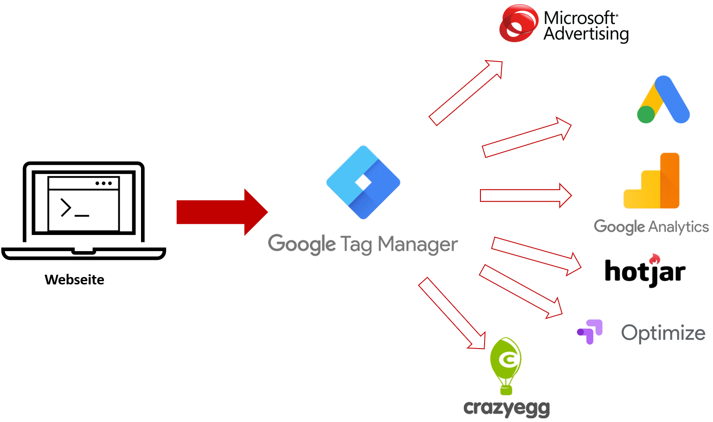{width="800"}

## Tools: Matomo

-   Datensouveränität, DSGVO-freundlich
-   On-Premise möglich
-   Transparentes Event-Tracking
-   Klassisches Webanalyse-Modell - Demo

## Tools: Google Analytics

\- Ereignisbasiertes Datenmodell\
- Automatische Events (Scrolls, Engagement, Outbound) - Kann auch Apps und Cross-Device Tracking - Moderne Metriken (Engaged Sessions, Predictive Signals)\
- Demo

------------------------------------------------------------------------

## KPIs: Reichweite

-   Unique Users
-   Daily / Weekly / Monthly Active Users (DAU/WAU/MAU)
-   Installs / First Opens (App)
-   Traffic-Quellen
-   Returning Visitor/User Rate
-   Visibility in AEO/GEO (AI Overviews, Chatbot-Responses)

------------------------------------------------------------------------

## KPIs: Engagement

-   Session Frequency (Sessions/User/Tag oder Woche)
-   Average Session Duration
-   Screens per Session (App)
-   Scrolltiefe (Web)
-   Element Visibility (Web)
-   Video-Metriken: Play Rate, Watch Time, Completion
-   Feature Usage (App)
-   In-App Events (z. B. „Added to Favourites“, „Completed Task“)

------------------------------------------------------------------------

## KPIs: Interaktion (Micro-Conversions)

-   CTA-Klicks
-   Downloads (PDF, Asset, Datei)
-   Formularstarts / Abbrüche
-   Copy-to-Clipboard
-   Onboarding Completion (App)
-   Push-Notification Opt-in / Interaktion
-   Deep-Link Events

------------------------------------------------------------------------

## KPIs: Conversion

-   Registrierungen
-   Abschlüsse / Purchases
-   Conversion Rate pro Funnel-Schritt
-   Assisted Conversions (Multi-Touch)
-   Upgrade Rate (Free → Paid, App)
-   In-App Purchase Rate

------------------------------------------------------------------------

## KPIs: Qualität & Stabilität (App)

-   Crash Rate
-   Error Events
-   App Start Time
-   Load Time / Latency
-   Failed Transactions
-   Rage Clicks / Dead Clicks (optional, Web & App)

------------------------------------------------------------------------

## KPIs: Bindung & Churn

-   Retention (Day 1 / Day 7 / Day 30)
-   Cohort Retention
-   Churn Rate
-   Re-Activation Rate
-   Push Notification Re-Engagement

## KPI vs. Ziel: Was ist der Unterschied?

**Ziel**\
- Beschreibt *was* erreicht werden soll\
- Ergebnisorientiert\
- Beispiel: „Mehr Registrierungen für meinen Kurs“

**KPI**\
- Beschreibt *wie gut* wir auf dem Weg zum Ziel sind\
- Messgröße, nicht das Ziel selbst\
- Beispiel: „Conversion Rate der Registrierungsseite“

Ziele definieren die Richtung – KPIs messen den Fortschritt.

------------------------------------------------------------------------

## Beispiele für Ziele und passende KPIs

**Ziel:** Mehr aktive Nutzer\
**KPI:** Daily/Weekly Active Users (DAU/WAU)

**Ziel:** Mehr Leads\
**KPI:** Formular-Conversion-Rate

**Ziel:** Bessere Content-Performance\
**KPI:** Scrolltiefe, Sichtbarkeit, Interaktionsraten

**Ziel:** Höhere Nutzerbindung\
**KPI:** 7-Tage-Retention, Churn Rate

## KPIs für Artikel / Blogposts

-   Scrolltiefe
-   Element Visibility (v. a. CTA / Weiterführende Links)
-   SERP-Klickrate
-   Returning Visitor Rate
-   Shares / Saves

------------------------------------------------------------------------

## KPIs für Videos

-   Play Rate
-   Average Watch Time
-   Completion Rate
-   Drop-off Points
-   CTA-Klick nach Videoende

------------------------------------------------------------------------

## KPIs für PDFs / Whitepaper / Downloads

-   Formularstart
-   Formularabschluss
-   Download Rate
-   Assisted Conversions
-   Sichtbarkeit der Download-Box (Element Visibility)

------------------------------------------------------------------------

## KPIs für interaktive Inhalte (Quiz, Tools, Rechner)

-   Task Success Rate
-   Feature Usage
-   Interaktionen (Tabs, Buttons, Module)
-   Conversion nach Nutzung
-   Time on Task

------------------------------------------------------------------------

## KPIs für App-Features

-   DAU/WAU
-   Feature Usage Events
-   Onboarding Completion
-   Retention (Day 1 / 7 / 30)
-   Churn Rate

------------------------------------------------------------------------

## KPIs für Newsletter / E-Mails

-   Open Rate
-   Click Rate
-   Unsubscribe Rate
-   Conversion Rate (z. B. Download, Anmeldung)
-   Deep-Link Engagement

------------------------------------------------------------------------

## Fallstricke bei der Interpretation

-   „Mehr Traffic“ ist kein sinnvolles Ziel
-   Verweildauer kann sowohl positive als auch negative Gründe haben
-   Scrolltiefe ≠ qualitatives Lesen
-   Event-Implementierung muss sauber sein (Schwellen, Debounce, Deduplikation)
-   Attribution beeinflusst Ergebnisse stärker als erwartet
-   Kleine Stichproben \>\> keine belastbaren Schlüsse

------------------------------------------------------------------------

## Machine Learning-Modell auf Basis von Scrolltiefe


## Machine Learning-Modell auf Basis von Scrolltiefe


------------------------------------------------------------------------

## Übung

**Für Ihre eigenen digitalen Inhalte:**\
1. Outcome\
2. Conversions\
3. Micro-Conversions definieren

# Sitzung 7: A/B Testing

------------------------------------------------------------------------

## Haben Sie sich jemals gefragt…

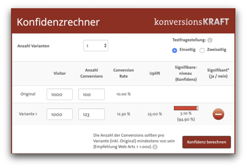

------------------------------------------------------------------------

## …wieso eine Conversion den Unterschied macht?

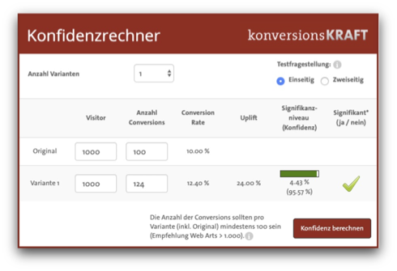

------------------------------------------------------------------------

## Das hängt alles mit dem p-Wert zusammen

-   Selbst Wissenschaftler können den p-Wert nicht immer erklären.
-   Viele wissenschaftliche Studien hängen von diesem p-Wert ab.
-   A/B-Tests hängen ebenso vom p-Wert ab
-   Darum wollen wir den p-Wert genau verstehen!

------------------------------------------------------------------------

## Die Statistik-Pille


------------------------------------------------------------------------

## Die klassische statistische Inferenz

-   Natürlich nehmen alle die rote Pille (wer den Unterschied nicht kennt, bitte heute Abend Matrix ansehen).
-   Einige haben ein Placebo bekommen → Kontrollgruppe.
-   Die anderen haben die Statistik-Pille bekommen → Testgruppe / Treatment.
-   Blindtest vs. Doppelblindtest
-   Randomisierung

------------------------------------------------------------------------

## Die klassische statistische Inferenz

-   **H0**: Nullhypothese, z.B. „Die Statistik-Pille hat keine Wirkung“.
-   **H1**: Alternativhypothese, z.B. „Die Statistik-Pille führt zu besseren Noten“.
-   Der Untersuchungsgegenstand muss isolierbar sein.
-   Wir arbeiten mit Stichproben, nicht der Grundgesamtheit.
-   Ziel: Vergleich der Mittelwerte zwischen Placebo und Treatment.

------------------------------------------------------------------------

## Normalverteilung mit Standardabweichungen

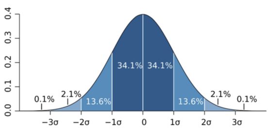

------------------------------------------------------------------------

## Was genau ist eine Standardabweichung?

-   Durchschnittliche Abweichung der Werte vom Mittelwert.
-   Werte eng beieinander → geringe Schwankung.
-   Werte weit gestreut → hohe Schwankung.
-   Zeigt Streuung, nicht nur den Durchschnitt.
-   Zwei Gruppen mit gleichem Mittelwert können völlig unterschiedliche Streuungen haben.

------------------------------------------------------------------------

## Wie weit sind die Daten um den Mittelwert verteilt: Streuung

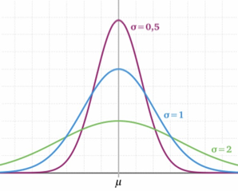

------------------------------------------------------------------------

## Hadlum vs Hadlum (1949)

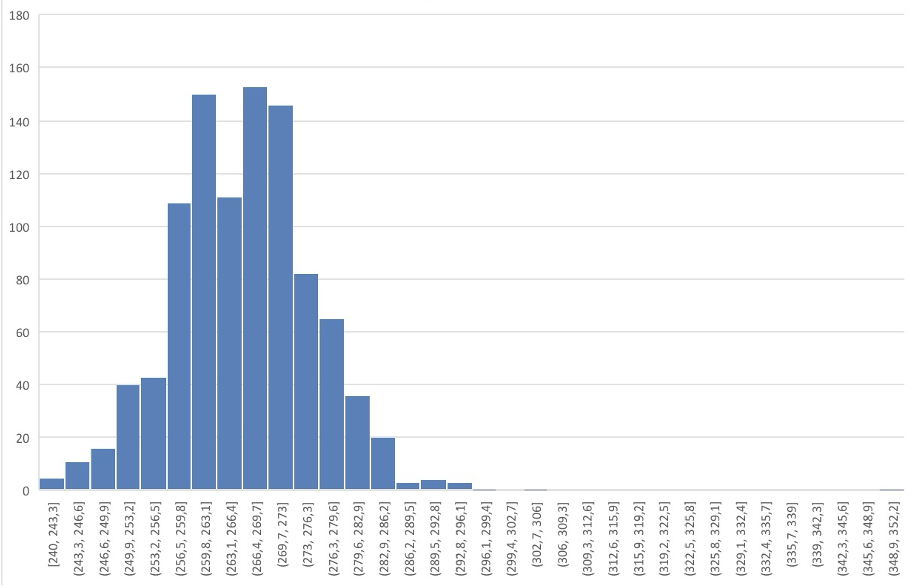

------------------------------------------------------------------------

## Was, wenn wir heute Mittag alle Stichproben nähmen?

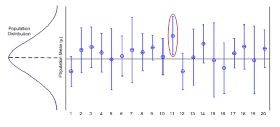

## Würfeln und der Zufall: Zentraler Grenzwertsatz

```{r}
# Simulation des Zentralen Grenzwertsatzes
n_samples <- 1000
sample_means <- numeric(n_samples)

for(i in 1:n_samples) {
  # Ziehe 30 Werte aus einer nicht-normalverteilten Grundgesamtheit
  sample_data <- runif(30, min=1, max=6)  # Gleichverteilung
  sample_means[i] <- mean(sample_data)
}

# Visualisierung der Verteilung der Stichprobenmittelwerte
hist(sample_means, breaks=30, main="Verteilung der Stichprobenmittelwerte",
     xlab="Mittelwert", probability=TRUE)
curve(dnorm(x, mean=mean(sample_means), sd=sd(sample_means)), 
      add=TRUE, col="red", lwd=2)
```

------------------------------------------------------------------------

## Stichprobenverteilung des Mittelwerts

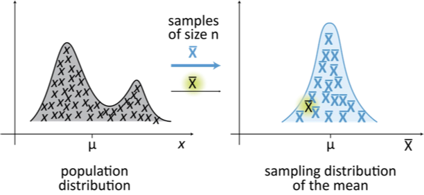

------------------------------------------------------------------------

## Normalverteilung mit Standardabweichungen


------------------------------------------------------------------------

## Ab wann ist etwas statistisch signifikant?

-   Abhängig vom Signifikanzniveau α (typisch 5%).
-   α kann variieren – je nach Schwere eines Fehlers.
-   Ein Ergebnis ist signifikant, wenn H0 gemäß α abgelehnt wird.
-   **p-Wert**: Wahrscheinlichkeit, dieses Stichprobenergebnis zu erhalten, wenn H0 wahr ist.

------------------------------------------------------------------------

## Würden News ohne die Nachrichtenanzahl gelesen werden?

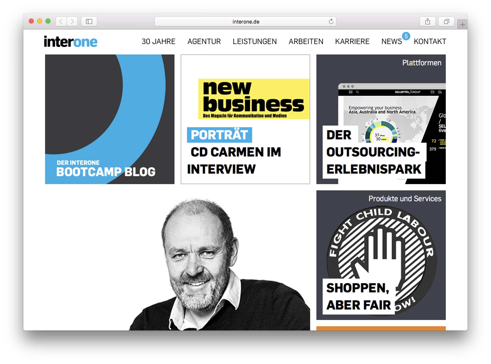

------------------------------------------------------------------------

## Der p-Wert am Beispiel Moderna (nicht mit Mittelwerten)

-   Studie mit 30.420 Teilnehmenden, 1:1 randomisiert.
-   185 Covid-Fälle in der Placebo-Gruppe vs. 11 in der Impf-Gruppe.
-   Impfstoffwirksamkeit: **94,1%** (95%-CI: 89,3–96,8%; p \< 0,001).
-   Schwere Verläufe: 30 – alle in der Placebo-Gruppe.

------------------------------------------------------------------------

## Fehler 1. und 2. Art (α und β-Fehler)


## Bekannt von Corona-Tests


------------------------------------------------------------------------

## p-Wert: Check! Aber woher weiß ich, was ich testen soll?

-   Abhängig von Effektstärke, Stichprobengröße u.a.
-   **Framework:**
    1.  Auf Basis *\[qualitativer und quantitativer Daten\]*
    2.  wird erwartet, dass *\[Änderung\]* für *\[Population\]* einen *\[Einfluss\]* hat,
    3.  der *\[KPI verändert\]* innerhalb von *\[Geschäftszyklus\]*.
-   Priorisierung nach Business-Impact.

------------------------------------------------------------------------

## Beispiel

1.  Auf Basis der Absprungrate von 80% von neuen Nutzern wird erwartet,\
2.  dass eine Änderung der Labels in der Navigation vor allem neue Nutzer besser abholt,\
3.  sodass die Absprungrate von neuen Nutzern innerhalb eines Monats auf unter 40% gedrückt werden kann.

# Sitzung 8: Referate

# Sitzung 9: Data Mining

------------------------------------------------------------------------

## KI: Mehr als LLMs

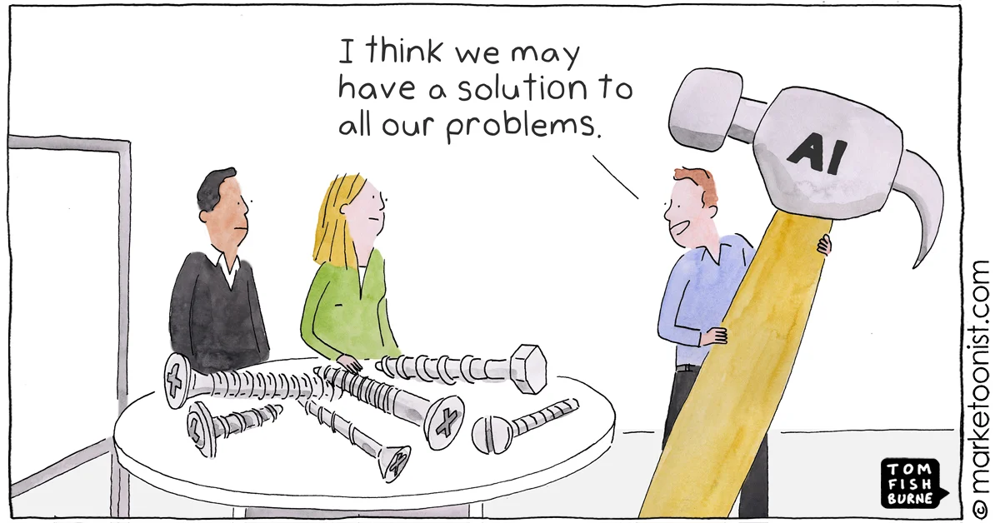

## Was ist Data Mining?

-   Verfahren aus dem KI-Kosmos
-   Systematische Identifikation von Mustern in Daten
-   Ziel: aus großen Datenmengen verwertbare Erkenntnisse ableiten
-   Typische Muster: Segmente, Regeln, Wahrscheinlichkeiten, Anomalien

------------------------------------------------------------------------

## Warum Data Mining?

-   Nutzerverhalten besser verstehen
-   Inhalte zielgerichteter entwickeln
-   Personalisierung und Empfehlung ermöglichen
-   Hypothesen datengetrieben prüfen

------------------------------------------------------------------------

## Denksportaufgabe

-   Warum sind die Empfehlungen von Spotify gut und die von Netflix nicht?
-   Warum funktionieren Nachrichten-Empfehlungen nicht?

## Kernaufgaben im Data Mining

-   Klassifikation
-   Regression
-   Clustering
-   Assoziationsanalyse
-   Anomalieerkennung

------------------------------------------------------------------------

## Assoziationsanalyse

-   Identifikation häufig gemeinsam auftretender Muster
-   Beispiel: „Wer A liest, liest oft auch B“
-   Anwendung: Content-Empfehlungen, Modul-Kombinationen auf Seiten, datengetriebene Personas

------------------------------------------------------------------------

## Beispiel

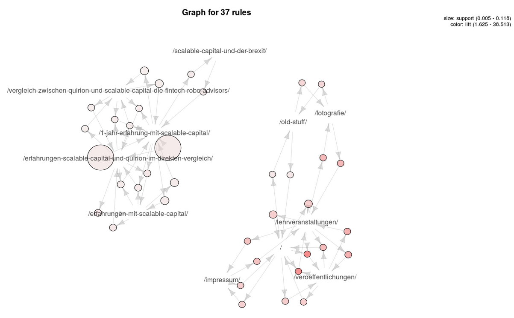

------------------------------------------------------------------------

## Klassifikation

-   Zuordnung von Daten zu festen Kategorien
-   Lernen aus bekannten Beispielen (Supervised)
-   Beispiel: „Spam“ oder „Relevant“?
-   Anwendung: Sentiment-Analyse, Churn-Prediction, Auto-Tagging

------------------------------------------------------------------------

## Decision Trees (old school)

-   Baumstruktur zur Vorhersage und Regelableitung
-   Gut interpretierbar
-   Zeigt, welche Merkmale Inhalte oder Nutzer unterscheiden
-   Anwendung: Erfolgsfaktoren für Content identifizieren

------------------------------------------------------------------------

## Decision Tree

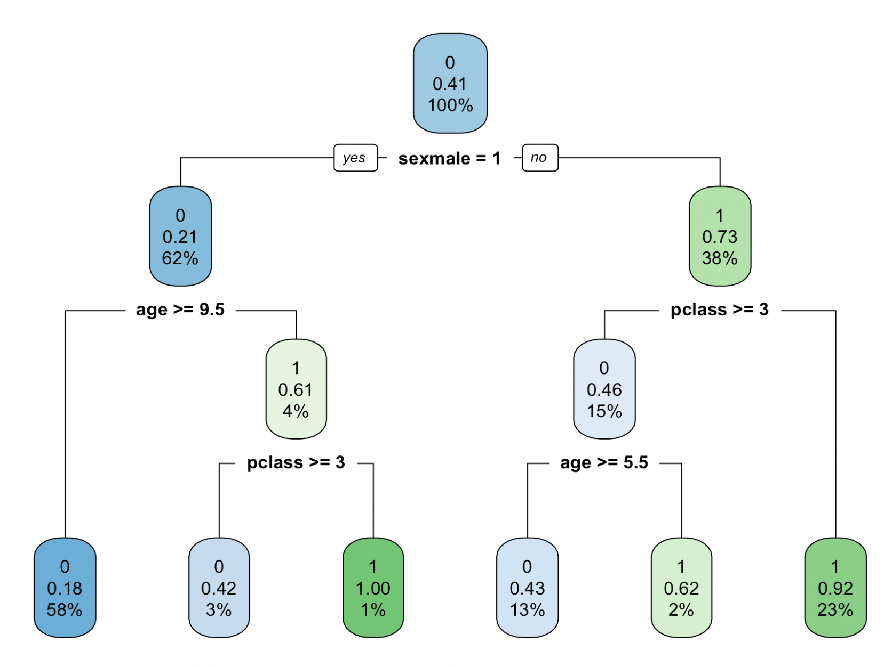

## Regression

-   Vorhersage von Zahlenwerten (statt Kategorien)
-   Untersucht Zusammenhang von Ursache und Wirkung
-   Beispiel: Videolänge $\rightarrow$ Verweildauer
-   Anwendung: Budget-Planung, ROI-Prognose, Trends

------------------------------------------------------------------------

## Regression Beispiel

```{r message=FALSE}
# Bibliotheken laden
library(ggplot2)

# 1. Daten simulieren (Dummy-Daten für den Kurs)
set.seed(42) # Für reproduzierbare Ergebnisse
n <- 50      # Anzahl der Artikel

# Zufällige Wortanzahl zwischen 300 und 2500 Wörtern
wortanzahl <- round(runif(n, min = 300, max = 2500))

# Lesezeit simulieren: Basiswert + Faktor * Wörter + Zufallsrauschen (Fehler)
# Annahme: Längere Texte = längere Lesezeit, aber nicht immer perfekt linear
lesezeit <- 20 + (wortanzahl * 0.12) + rnorm(n, mean = 0, sd = 40)

# In Dataframe packen
df <- data.frame(Wortanzahl = wortanzahl, Lesezeit = lesezeit)

# 2. Plot erstellen
ggplot(df, aes(x = Wortanzahl, y = Lesezeit)) +
  
  # Die Punkte (Streudiagramm)
  geom_point(alpha = 0.6, size = 3, color = "#2C3E50") + 
  
  # Die Regressionsgerade (Linear Model = lm)
  # 'se = TRUE' zeigt den grauen Konfidenzbereich (Schatten) an
  geom_smooth(method = "lm", color = "#E74c3C", size = 1.5, se = TRUE) +
  
  # Beschriftung (Deutsch)
  labs(
    title = "Regression: Einfluss der Textlänge",
    subtitle = "Zusammenhang zwischen Wortanzahl und Verweildauer (Sek.)",
    x = "Anzahl der Wörter",
    y = "Lesezeit (Sekunden)"
  ) +
  
  # Design (Minimalistisch für Folien)
  theme_minimal(base_size = 16) +
  theme(
    plot.title = element_text(face = "bold"),
    panel.grid.minor = element_blank() # Weniger Gitterlinien für Ruhe
  )

# 3. Bild speichern (optional)
# ggsave("regression-chart.png", width = 8, height = 5, dpi = 300)
```

## Clustering

-   Gruppierung ähnlicher Beobachtungen (ohne Labels)
-   Methoden: K-Means, hierarchisches Clustering
-   Anwendung: Themencluster, Nutzersegmente, Content-Typen

------------------------------------------------------------------------

## LLMs als Explorationswerkzeug

-   Extrahieren semantischer Muster in Textdaten
-   Gut für: Themenvorschläge, Zusammenfassungen, Hypothesen
-   Keine statistische Evidenz, keine Kausalität
-   Ergänzen, nicht ersetzen klassische Data-Mining-Methoden

------------------------------------------------------------------------

## End-to-End-Prozess: VoC

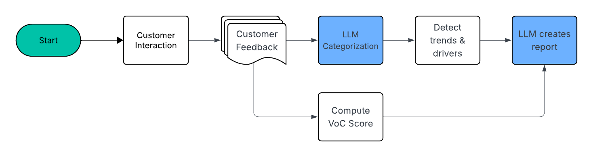

------------------------------------------------------------------------

## Demo

------------------------------------------------------------------------

## Ihre Aufgabe

-   Wie können Sie Daten verwenden in Ihrem Projekt?
-   Wie können Daten helfen, Ihr Projekt zu verbessern?
-   Welche der vorgestellten Methoden könnten Ihnen dabei helfen?

------------------------------------------------------------------------

# Sitzung 10: Datenvisualisierung

## Warum Datenvisualisierung?

The greatest value of a picture is when it forces us to notice what we never expected to see. (John Tukey)

## Warum Datenvisualisierung? II

- Reduktion von Cognitive Load (Gehirn-Entlastung)
- Niemand versteht eine Excel-Tabelle mit 10.000 Zeilen in 5 Sekunden. Ein Streudiagramm verstehen wir sofort.
- In der „Aufmerksamkeitsökonomie“ haben Stakeholder und User keine Zeit. 
- Visualisierung ist der schnellste Weg, Informationen ins Gehirn des Gegenübers zu transportieren.  


## Warum Datenvisualisierung III

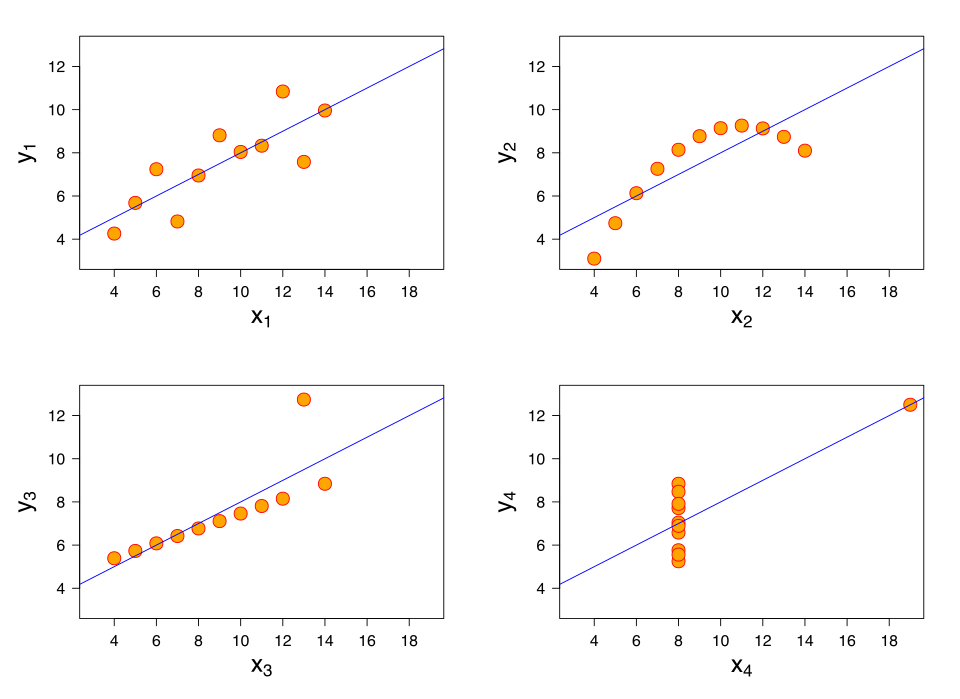

## Warum Datenvisualisierung IV

- Überzeugungskraft (Data Storytelling)
- Zahlen sind abstrakt, Bilder sind emotionaler und überzeugender. 
- Wer Budget für ein digitales Produkt will, muss das Management mit Charts überzeugen, nicht mit Rohdaten.  

## Warum Datenvisualisierung V

- Data Literacy ist ein Karriere-Booster
- Content-Erstellung wird zunehmend automatisiert (KI)
- Die Fähigkeit, Ergebnisse zu interpretieren und darzustellen, wird die Kompetenz sein, die den Menschen (noch) von der KI unterscheidet.

## 5 wichtige Schritte

1.  Was ist der Kontext?
    -   An wen wird kommuniziert?
    -   Was soll der Empfänger wissen oder tun?
    -   Welche Daten sind vorhanden, um den Case zu untermauern?

## 5 wichtige Schritte

2.  Welche ist das passendste Visualierung?
    -   Ein oder zwei Zahlen, die im Fokus stehen? =\> Text!
    -   Liniendiagramme für continuous data
    -   Säulendiagramme für kategoriale Daten, müssen bei 0 anfangen
    -   Die Beziehungen der Daten untereinander bestimmen die Visualisierung, sofern Sie mehr als eine Variable haben
    -   Vermeiden Sie Tortendiagramme, Donuts, 3D, zweite Y-Achsen

## 5 wichtige Schritte

3.  Entfernen Sie „Clutter"
    1.  Entfernen Sie alles, das keinen informativen Mehrwert hat (z.B. Farben für die Ästhetik)
    2.  Arbeiten Sie mit freiem Raum

## 5 wichtige Schritte

4.  Fokussieren Sie die Aufmerksamkeit, wo Sie hin soll
    -   Größe, Position und, ja, manchmal auch Farbe nutzen um zu signalisieren, was wichtig ist
    -   Wohin gehen die Augen?

## 5 wichtige Schritte

::::: columns
::: {.column width="60%"}
5.  Nutzen Sie Storytelling
    -   Niemand will einfach nur Auflistungen von Zahlen und Diagrammen sehen.
    -   Schreiben Sie einen Plot. Anfang, eventuell sogar einen Twist, und ein Ende mit Call to Action (in der Wissenschaft reicht eine Diskussion ☺)
    -   Bitte arbeiten Sie nicht einfach nur mechanisch alles ab, was Sie können.
:::

::: {.column width="40%"}

:::
:::::

## Redundant Coding

::::: columns
::: {.column width="50%"}
```{r, fig.width=10, fig.height=10, out.width="100%"}
# Pakete laden
library(ggplot2)

# Pakete laden
library(ggplot2)

# Linker Plot (mit Kreisen für alle Arten)
ggplot(iris, aes(x = Sepal.Length, y = Sepal.Width, color = Species)) +
  geom_point(size = 3, alpha = 0.7) +
  scale_color_manual(values = c("setosa" = "#d8b365", 
                               "virginica" = "#5ab4ac", 
                               "versicolor" = "#a6cee3")) +
  scale_x_continuous(limits = c(4, 8), breaks = seq(4, 8, 1)) +
  scale_y_continuous(limits = c(2, 4.5), breaks = seq(2, 4.5, 0.5)) +
  labs(x = "sepal length", y = "sepal width") +
  theme_bw() +
  theme(legend.position = "right",
        legend.title = element_blank(),
        panel.grid.minor = element_blank(),
        aspect.ratio = 1) # Macht den Plot quadratisch

# Um den Plot zu speichern mit quadratischen Abmessungen
# ggsave("iris_plot_left.png", width = 7, height = 7)
```
:::

::: {.column width="50%"}
```{r, fig.width=10, fig.height=10, out.width="100%"}
# Pakete laden
library(ggplot2)

# Rechter Plot (mit unterschiedlichen Symbolen für jede Art)
ggplot(iris, aes(x = Sepal.Length, y = Sepal.Width, 
                 color = Species, shape = Species)) +
  geom_point(size = 3, alpha = 0.7) +
  scale_color_manual(values = c("setosa" = "#a6cee3", 
                               "virginica" = "#5ab4ac", 
                               "versicolor" = "#d8b365")) +
  scale_shape_manual(values = c("setosa" = 16,  # Kreis (gefüllt)
                               "virginica" = 21, # Kreis (leer)
                               "versicolor" = 22)) + # Quadrat (leer)
  scale_x_continuous(limits = c(4, 8), breaks = seq(4, 8, 1)) +
  scale_y_continuous(limits = c(2, 4.5), breaks = seq(2, 4.5, 0.5)) +
  labs(x = "sepal length", y = "sepal width") +
  theme_bw() +
  theme(legend.position = "right",
        legend.title = element_blank(),
        panel.grid.minor = element_blank(),
        aspect.ratio = 1) # Macht den Plot quadratisch

# Um den Plot zu speichern mit quadratischen Abmessungen
# ggsave("iris_plot_right.png", width = 7, height = 7)
```
:::
:::::

## Weißer Space ist gut… aber nicht zu viel!

::::: columns
::: {.column width="50%"}
```{r}
# Benötigte Pakete
library(ggplot2)
library(dplyr)

# Daten vorbereiten (Titanic-Datensatz)
# Falls nicht vorhanden: install.packages("titanic")
library(titanic)
data("titanic_train")

# Daten aufbereiten
titanic_data <- titanic_train %>%
  mutate(
    Sex = factor(Sex, levels = c("female", "male")),
    Survived = factor(ifelse(Survived == 1, "survived", "died")),
    Pclass = factor(Pclass, labels = c("1st", "2nd", "3rd"))
  ) %>%
  count(Pclass, Sex, Survived) %>%
  rename(count = n)

# Linker Plot (komplett ohne Linien, "ugly")
ggplot(titanic_data, aes(x = Sex, y = count, fill = Sex)) +
  geom_col() +
  facet_grid(Pclass ~ Survived) +
  scale_fill_manual(values = c("female" = "#E69F00", "male" = "#4472C4")) +
  scale_y_continuous(limits = c(0, 180), breaks = c(0, 50, 100, 150)) +
  labs(y = "count") +
  theme(
    legend.position = "none",
    panel.spacing = unit(0.5, "mm"),      # Minimaler Abstand zwischen Panels
    panel.grid.major = element_blank(),   # Keine Hauptgitterlinien
    panel.grid.minor = element_blank(),   # Keine Nebengitterlinien
    panel.border = element_blank(),       # Kein Panelrahmen
    panel.background = element_blank(),   # Kein Panelhintergrund
    strip.background = element_blank(),   # Kein Hintergrund für Beschriftungen
    strip.text = element_text(hjust = 0.5, size = 10),
    axis.line = element_blank(),          # Keine Achsenlinien
    axis.ticks = element_blank(),         # Keine Achsenmarkierungen
    axis.title.x = element_blank(),
    plot.margin = unit(c(0.5, 0.5, 0.5, 0.5), "mm")  # Minimaler Außenabstand
  )
```
:::

::: {.column width="50%"}
```{r}
# Benötigte Pakete
library(ggplot2)
library(dplyr)

# Daten vorbereiten (Titanic-Datensatz)
# Falls nicht vorhanden: install.packages("titanic")
library(titanic)
data("titanic_train")

# Daten aufbereiten
titanic_data <- titanic_train %>%
  mutate(
    Sex = factor(Sex, levels = c("female", "male")),
    Survived = factor(ifelse(Survived == 1, "survived", "died")),
    Pclass = factor(Pclass, labels = c("1st", "2nd", "3rd"))
  ) %>%
  count(Pclass, Sex, Survived) %>%
  rename(count = n)

# Rechter Plot (mehr Weißraum, besser lesbar)
ggplot(titanic_data, aes(x = Sex, y = count, fill = Sex)) +
  geom_col() +
  facet_grid(Pclass ~ Survived) +
  scale_fill_manual(values = c("female" = "#E69F00", "male" = "#4472C4")) +
  scale_y_continuous(limits = c(0, 180), breaks = c(0, 50, 100, 150)) +
  labs(y = "count") +
  theme_minimal() +
  theme(
    legend.position = "none",
    panel.spacing = unit(5, "mm"),     # Mehr Abstand zwischen Panels
    panel.background = element_rect(fill = "#F1F1F1", color = NA), # Hellgrauer Hintergrund
    strip.background = element_rect(fill = "white", color = NA), # Weißer Streifen für Überschriften
    strip.text = element_text(hjust = 0.5, size = 10),
    axis.title.x = element_blank(),
    plot.margin = unit(c(5, 5, 5, 5), "mm")  # Mehr Außenabstand
  )
```
:::
:::::

## Highlighting

```{r}
# Benötigte Pakete laden
library(nycflights23)
library(dplyr)
library(ggplot2)

# Mittlere Ankunftsverspätung pro Fluggesellschaft berechnen
airline_delays <- flights %>%
  group_by(carrier) %>%
  summarise(mean_delay = mean(arr_delay, na.rm = TRUE)) %>%
  #filter(mean_delay > 0) %>%
  # Fluggesellschaftsnamen hinzufügen
  left_join(airlines, by = "carrier") %>%
  # Nach Verspätung sortieren
  arrange(mean_delay)

# Einen Vektor für Farben erstellen (alle grau außer ExpressJet, das hervorgehoben wird)
# ExpressJet hat im Datensatz den Code "EV"
farben <- ifelse(airline_delays$carrier == "G4", "#B22222", "#AAAAAA")

# Horizontalen Balkenplot erstellen
ggplot(airline_delays, aes(x = reorder(name, mean_delay), y = mean_delay)) +
  geom_col(fill = farben) +
  coord_flip() +  # Für horizontale Balken
  labs(
    title = "",
    x = "",
    y = "mean arrival delay (min.)"
  ) +
  theme_minimal() +
  theme(
    panel.grid.major.y = element_blank(),
    panel.grid.minor.y = element_blank()
  )
```

## Wie identifiziert man das richtige Diagramm?


## Scatter Plot / Streudiagramm

::::: columns
::: {.column width="60%"}
-   Zeigt Beziehung zwischen zwei kontinuierlichen Variablen
-   Jeder Punkt = eine Beobachtung
-   Erkennt Muster, Cluster, Ausreißer und Korrelationen
-   Benötigt numerische X/Y-Achsen
-   Dritte Dimension durch Punktgröße/Farbe möglich
:::

::: {.column width="40%"}
```{r}
#| echo: false
#| fig-width: 5
#| fig-height: 5
library(ggplot2)
set.seed(42)
scatter_data <- data.frame(
  x = rnorm(100),
  y = rnorm(100),
  gruppe = sample(LETTERS[1:3], 100, replace = TRUE)
)
# Korrelation hinzufügen
scatter_data$y <- scatter_data$y + scatter_data$x - 0.7 + rnorm(100, 0, 0.5)
ggplot(scatter_data, aes(x = x, y = y, color = gruppe)) +
  geom_point(size = 3, alpha = 0.7) +
  scale_color_brewer(palette = "Set1") +
  theme_minimal() +
  labs(x = "Variable X", y = "Variable Y", color = "Gruppe")
```
:::
:::::

## Korrelationsmatrix

::::: columns
::: {.column width="60%"}
-   Zeigt Korrelationsstärke zwischen Variablen
-   Farbe/Größe visualisiert Richtung und Stärke
-   Unterscheidet klar positive/negative Korrelationen
-   Identifiziert Muster und redundante Variablen
-   Essentiell für explorative Datenanalyse
:::

::: {.column width="40%"}
```{r}
#| echo: false
#| fig-width: 5
#| fig-height: 5
library(ggplot2)
library(reshape2)

# Direkt eine gültige Korrelationsmatrix erstellen
set.seed(123)
vars <- 5
varNames <- LETTERS[1:vars]

# Simulierte Daten direkt erstellen
sim_data <- data.frame(
  A = rnorm(100),
  B = rnorm(100),
  C = rnorm(100),
  D = rnorm(100),
  E = rnorm(100)
)
# Korrelationen hinzufügen
sim_data$B <- sim_data$B + sim_data$A - 0.7 + rnorm(100, 0, 0.5)
sim_data$C <- sim_data$C - sim_data$A - 0.4 + rnorm(100, 0, 0.5)
sim_data$D <- sim_data$D + sim_data$B - 0.6 + rnorm(100, 0, 0.5)
sim_data$E <- sim_data$E - sim_data$C - 0.5 + sim_data$D - 0.3 + rnorm(100, 0, 0.5)

# Korrelationsmatrix berechnen
cormat <- round(cor(sim_data), 2)
melted_cormat <- melt(cormat)

ggplot(melted_cormat, aes(x = Var1, y = Var2, fill = value)) +
  geom_tile(color = "white") +
  scale_fill_gradient2(low = "firebrick", high = "steelblue", mid = "white", 
                     midpoint = 0, limit = c(-1,1)) +
  geom_text(aes(label = round(value, 2)), color = "black", size = 3) +
  theme_minimal() +
  coord_equal() +
  labs(fill = "Korrelation")
```
:::
:::::

## Venn-Diagramm

::::: columns
::: {.column width="60%"}
-   Zeigt gemeinsame und einzigartige Elemente
-   Überschneidungen visualisieren Gemeinsamkeiten
-   Ideal für Vergleich von Kategorien/Merkmalen
-   Funktioniert am besten mit 2-3 Gruppen
-   Wird mit mehr als 5 Gruppen unübersichtlich
:::

::: {.column width="40%"}

:::
:::::

## UpSet Diagram

::::: columns
::: {.column width="60%"}
-   Alternative für komplexe Überschneidungen
-   Skalierbarer als klassische Venn-Diagramme
-   Balken visualisieren Überschneidungsgrößen
-   Punkte zeigen beteiligte Mengen
-   Ideal für 4+ Gruppen/komplexe Beziehungen
:::

::: {.column width="40%"}

:::
:::::

## Sankey Diagram

::::: columns
::: {.column width="60%"}
-   Visualisiert Flüsse zwischen Kategorien
-   Pfeilbreite zeigt Volumen/Wert
-   Ideal für Verteilungen und Prozesse
-   Zeigt Herkunft und Ziel von Ressourcen
-   Verdeutlicht Proportionen über mehrere Stufen
:::

::: {.column width="40%"}
```{r}
#| echo: false
#| fig-width: 5
#| fig-height: 5
library(ggplot2)
library(ggalluvial)
# Sankey/Alluvial Diagramm
sankey_data <- data.frame(
  Quelle = rep(c("A", "B", "C"), times = c(3, 2, 2)),
  Ziel = c("X", "Y", "Z", "X", "Y", "Y", "Z"),
  Wert = c(5, 3, 2, 2, 3, 1, 4)
)
ggplot(sankey_data, aes(axis1 = Quelle, axis2 = Ziel, y = Wert)) +
  geom_alluvium(aes(fill = Quelle), width = 1/3) +
  geom_stratum(width = 1/3, fill = "grey80", color = "grey50") +
  geom_text(stat = "stratum", aes(label = after_stat(stratum))) +
  scale_fill_brewer(palette = "Set1") +
  theme_minimal() +
  labs(x = NULL, y = NULL) +
  theme(legend.position = "none",
        axis.text.y = element_blank(),
        axis.ticks = element_blank())
```
:::
:::::

## Horizontal Bar Chart

::::: columns
::: {.column width="60%"}
-   Vergleicht Werte über Kategorien hinweg
-   Horizontale Anordnung für bessere Lesbarkeit
-   Ideal für lange Namen oder viele Kategorien
-   Perfekt für Rankings und Wertvergleiche
-   Einfach und übersichtlich
:::

::: {.column width="40%"}
```{r}
#| echo: false
#| fig-width: 5
#| fig-height: 5
library(ggplot2)
hbar_data <- data.frame(
  kategorie = c("Kategorie mit sehr langem Namen A", 
                "Kategorie B", 
                "Kategorie C", 
                "Kategorie D", 
                "Kategorie E"),
  wert = c(85, 72, 56, 41, 25)
)
ggplot(hbar_data, aes(x = reorder(kategorie, wert), y = wert)) +
  geom_bar(stat = "identity", fill = "steelblue") +
  coord_flip() +
  theme_minimal() +
  labs(x = NULL, y = "Wert") +
  geom_text(aes(label = wert), hjust = -0.2) +
  ylim(0, max(hbar_data$wert) - 1.15)
```
:::
:::::

## Column Chart

::::: columns
::: {.column width="60%"}
-   Vergleicht Werte mit vertikalen Balken
-   Ideal für Ranking und Leistungsvergleiche
-   Funktioniert gut mit wenigen, klaren Kategorien
-   Kurze, lesbare Beschriftungen bevorzugen
-   Konsistente Nullbasislinie für faire Vergleiche
:::

::: {.column width="40%"}
```{r}
#| echo: false
#| fig-width: 5
#| fig-height: 5
library(ggplot2)
column_data <- data.frame(
  kategorie = factor(c("A", "B", "C", "D", "E"), levels = c("A", "B", "C", "D", "E")),
  wert = c(85, 72, 56, 41, 25)
)
ggplot(column_data, aes(x = kategorie, y = wert, fill = kategorie)) +
  geom_bar(stat = "identity", width = 0.7) +
  scale_fill_brewer(palette = "Set2") +
  theme_minimal() +
  labs(x = NULL, y = "Wert") +
  theme(legend.position = "none") +
  geom_text(aes(label = wert), vjust = -0.5) +
  ylim(0, max(column_data$wert) - 1.1)
```
:::
:::::

## Vergleich: Horizontal vs. Vertical Bar Charts

| Feature | Horizontal | Vertical |
|------------------------|------------------------|------------------------|
| Best for | Long category labels, many items | Time-based or logical progression |
| Readability | Easier when labels are long | Requires rotation for long labels |
| Use case | Rankings, survey responses | Trends over time, grouped comparisons |
| Scan direction | Left to right | Bottom to top |
| Visual space | Efficient for many categories | Better for fewer, high-impact bars |

## Circular Bar Plot

::::: columns
::: {.column width="60%"}
-   Kreisförmige Darstellung von Werten mit Kategorien
-   Farbcodierung zeigt Gruppenzugehörigkeit
-   Kompakte Darstellung von Mustern und Beziehungen
-   Ideal für visuelles Storytelling
-   Beschriftungen sparsam und deutlich halten
:::

::: {.column width="40%"}
```{r}
#| echo: false
#| fig-width: 5
#| fig-height: 5
library(ggplot2)
library(dplyr)
data <- data.frame(
  category = rep(LETTERS[1:4], each = 5),
  subcategory = rep(1:5, 4),
  value = sample(20:100, 20)
)
ggplot(data, aes(x = subcategory, y = value, fill = category)) +
  geom_bar(stat = "identity", position = "dodge") +
  coord_polar() +
  scale_fill_brewer(palette = "Set2") +
  theme_minimal()
```
:::
:::::

## Diverging Bars

::::: columns
::: {.column width="60%"}
-   Zeigt Abweichungen in zwei Richtungen
-   Links/rechts von zentraler Basislinie
-   Ideal für Kontraste (positiv/negativ)
-   Zeigt Gleichgewicht vs. Ungleichgewicht
-   Gut für normalisierte Werte oder Z-Scores
:::

::: {.column width="40%"}
```{r}
#| echo: false
#| fig-width: 5
#| fig-height: 5
library(ggplot2)
diverging_data <- data.frame(
  category = factor(LETTERS[1:8], levels = LETTERS[8:1]),
  value = c(5, -2, 8, -3, 6, -1, 4, -7)
)
ggplot(diverging_data, aes(x = category, y = value, fill = value > 0)) +
  geom_bar(stat = "identity") +
  scale_fill_manual(values = c("firebrick", "steelblue"), guide = "none") +
  coord_flip() +
  theme_minimal() +
  labs(y = "Abweichung vom Mittelwert")
```
:::
:::::

## Diverging Lollipop Chart

::::: columns
::: {.column width="60%"}
-   Elegantere Alternative zu Diverging Bars
-   Nutzt Punkte statt Balken (weniger Tinte)
-   Zeigt Richtung und Magnitude effektiv
-   Ideal wenn genaue Werte sekundär sind
-   Besonders gut für Präsentationen
:::

::: {.column width="40%"}
```{r}
#| echo: false
#| fig-width: 5
#| fig-height: 5
library(ggplot2)
lollipop_data <- data.frame(
  category = factor(LETTERS[1:8], levels = LETTERS[8:1]),
  value = c(5, -2, 8, -3, 6, -1, 4, -7)
)
ggplot(lollipop_data, aes(x = category, y = value, color = value > 0)) +
  geom_segment(aes(y = 0, x = category, yend = value, xend = category), color = "grey") +
  geom_point(size = 3) +
  scale_color_manual(values = c("firebrick", "steelblue"), guide = "none") +
  coord_flip() +
  theme_minimal() +
  labs(y = "Abweichung vom Mittelwert")
```
:::
:::::

## Histogram

::::: columns
::: {.column width="60%"}
-   Zeigt Verteilung numerischer Daten in Bins
-   Balken zeigen Häufigkeiten in Wertebereichen
-   Erkennt Schiefe, Streuung und Ausreißer
-   Zeigt Modi und Clustering in Daten
-   Berührende Balken betonen Kontinuität
:::

::: {.column width="40%"}
```{r}
#| echo: false
#| fig-width: 5
#| fig-height: 5
library(ggplot2)
set.seed(123)
hist_data <- data.frame(
  value = c(rnorm(400, mean = 5, sd = 1), rnorm(100, mean = 8, sd = 0.5))
)
ggplot(hist_data, aes(x = value)) +
  geom_histogram(bins = 30, fill = "steelblue", color = "white") +
  theme_minimal() +
  labs(y = "Häufigkeit")
```
:::
:::::

## Boxplot


## Boxplots

::::: columns
::: {.column width="60%"}
-   Zeigt Minimum, Quartile und Median
-   Kompakte Darstellung von Verteilungen
-   Hebt Streuung und Ausreißer hervor
-   Ideal zum Kategorienvergleich
-   Kann für Laien schwer verständlich sein
:::

::: {.column width="40%"}
```{r}
#| echo: false
#| fig-width: 5
#| fig-height: 5
library(ggplot2)
set.seed(123)
box_data <- data.frame(
  category = rep(c("A", "B", "C", "D"), each = 100),
  value = c(
    rnorm(100, mean = 5, sd = 1),
    rnorm(100, mean = 7, sd = 1.5),
    rnorm(100, mean = 4, sd = 0.8),
    rnorm(100, mean = 6, sd = 2)
  )
)
ggplot(box_data, aes(x = category, y = value, fill = category)) +
  geom_boxplot() +
  scale_fill_brewer(palette = "Set2", guide = "none") +
  theme_minimal()
```
:::
:::::

## Boxplot mit unseren Verspätungsdaten

```{r}
# Benötigte Pakete laden
library(nycflights23)
library(dplyr)
library(ggplot2)

# Daten filtern (nur positive Verspätungen) und vorbereiten
delay_data <- flights %>%
  left_join(airlines, by = "carrier")  # Fluggesellschaftsnamen hinzufügen

# Reihenfolge der Fluggesellschaften nach Median-Verspätung festlegen
carrier_order <- delay_data %>%
  group_by(carrier, name) %>%
  summarise(median_delay = median(arr_delay, na.rm = TRUE), .groups = "drop") %>%
  arrange(median_delay)

# Farben definieren (ExpressJet hervorgehoben, Rest grau)
# (Angenommen, Sie möchten ExpressJet hervorheben, das Code "EV" hat)
delay_data$color <- ifelse(delay_data$carrier == "G4", "#B22222", "#AAAAAA")

# Boxplot erstellen
ggplot(delay_data, aes(x = factor(name, levels = carrier_order$name), y = arr_delay)) +
  geom_boxplot(aes(fill = color), outlier.shape = NA, varwidth = TRUE) +  # outlier.shape = NA entfernt Ausreißer für bessere Lesbarkeit
  coord_flip() +  # Horizontale Boxplots
  scale_fill_identity() +  # Verwende die definierten Farben direkt
  scale_y_continuous(limits = c(-50, 150)) +  # Limitiere y-Achse für bessere Lesbarkeit
  labs(
    title = "Verteilung der Ankunftsverspätungen nach Fluggesellschaft",
    x = "",
    y = "arrival delay (min.)"
  ) +
  theme_minimal() +
  theme(
    panel.grid.major.y = element_blank(),
    panel.grid.minor.y = element_blank()
  )
```

## Boxplots mit Violin Plot

::::: columns
::: {.column width="60%"}
-   Kombiniert Boxplot mit Dichteverteilung
-   Zeigt Form, Streuung und zentrale Tendenz
-   Ideal für Gruppenvergleiche
-   Verdeutlicht Schiefe und Multimodalität
-   Informationsreichere Alternative zum Boxplot
:::

::: {.column width="40%"}
```{r}
#| echo: false
#| fig-width: 5
#| fig-height: 5
library(ggplot2)
set.seed(123)
violin_data <- data.frame(
  category = rep(c("A", "B", "C"), each = 100),
  value = c(
    c(rnorm(50, 5, 1), rnorm(50, 8, 0.5)),
    rnorm(100, 7, 1.5),
    rnorm(100, 6, 0.7)
  )
)
ggplot(violin_data, aes(x = category, y = value, fill = category)) +
  geom_violin(alpha = 0.7) +
  geom_boxplot(width = 0.2, fill = "white", alpha = 0.7) +
  scale_fill_brewer(palette = "Set2", guide = "none") +
  theme_minimal()
```
:::
:::::

## Choropleth Map

::::: columns
::: {.column width="60%"}
-   Färbt Regionen basierend auf Datenwerten
-   Zeigt räumliche Muster und Unterschiede
-   Gut für Verhältnisse und Prozentsätze
-   Nutze normalisierte Daten (pro Kopf, %)
-   Vorsicht bei großen Flächenunterschieden
:::

::: {.column width="40%"}

:::
:::::

## Stacked Area Chart

::::: columns
::: {.column width="60%"}
-   Zeigt Kategorienbeiträge im Zeitverlauf
-   Gestapelte Schichten zeigen Gesamtsumme
-   Gut für Wachstum und Anteile
-   Funktioniert am besten mit wenigen Kategorien
-   Einzelsegmentvergleich schwierig
:::

::: {.column width="40%"}
```{r}
#| echo: false
#| fig-width: 5
#| fig-height: 5
library(ggplot2)
set.seed(42)
years <- 2010:2020
area_data <- data.frame(
  year = rep(years, 4),
  category = rep(c("A", "B", "C", "D"), each = length(years)),
  value = c(
    10:20 + rnorm(11, 0, 1),
    20:30 - rnorm(11, 0, 1),
    15:25 + rnorm(11, 0, 2),
    25:35 + rnorm(11, 0, 1.5)
  )
)
ggplot(area_data, aes(x = year, y = value, fill = category)) +
  geom_area() +
  scale_fill_brewer(palette = "Set2") +
  theme_minimal()
```
:::
:::::

## Stacked 100% Area Chart

::::: columns
::: {.column width="60%"}
-   Zeigt relative Anteile, nicht absolute Werte
-   Verfolgt Änderungen von Kategorienanteilen
-   Summe immer 100% für leichte Vergleichbarkeit
-   Fokus auf Zusammensetzung, nicht Wachstum
-   Absolute Trends gehen verloren
:::

::: {.column width="40%"}
```{r}
#| echo: false
#| fig-width: 5
#| fig-height: 5
library(ggplot2)
set.seed(42)
years <- 2010:2020
area100_data <- data.frame(
  year = rep(years, 4),
  category = rep(c("A", "B", "C", "D"), each = length(years)),
  value = c(
    10:20 + rnorm(11, 0, 1),
    20:30 - rnorm(11, 0, 1),
    15:25 + rnorm(11, 0, 2),
    25:35 + rnorm(11, 0, 1.5)
  )
)
ggplot(area100_data, aes(x = year, y = value, fill = category)) +
  geom_area(position = "fill") +
  scale_y_continuous(labels = scales::percent) +
  scale_fill_brewer(palette = "Set2") +
  theme_minimal() +
  labs(y = "Anteil")
```
:::
:::::

## Stacked 100% Area Chart Beispiel

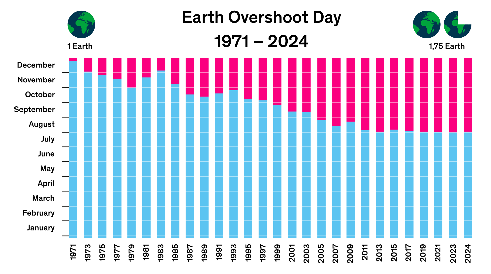

## Waterfall Diagram

::::: columns
::: {.column width="60%"}
-   Zeigt Beiträge zu einer Gesamtsumme
-   Visualisiert Zu- und Abnahmen über Kategorien
-   Hebt schrittweise Veränderungen hervor
-   Ideal für Gewinn- oder Budgetanalysen
-   Zeigt Faktoren für das Endergebnis
:::

::: {.column width="40%"}
```{r}
#| echo: false
#| fig-width: 5
#| fig-height: 5
library(ggplot2)
waterfall_data <- data.frame(
  stage = factor(c("Start", "Einnahmen", "Kosten", "Steuern", "Ende"), 
                levels = c("Start", "Einnahmen", "Kosten", "Steuern", "Ende")),
  value = c(0, 50, -30, -10, 0),
  end = c(100, 150, 120, 110, 110),
  start = c(100, 100, 150, 120, 110),
  type = c("total", "in", "out", "out", "total")
)
ggplot(waterfall_data, aes(x = stage, y = value, fill = type)) +
  geom_rect(aes(x = stage, xmin = as.numeric(stage) - 0.4, 
                xmax = as.numeric(stage) + 0.4, 
                ymin = pmin(start, end), ymax = pmax(start, end)), color = "black") +
  scale_fill_manual(values = c("in" = "steelblue", "out" = "firebrick", "total" = "darkgrey"), 
                    guide = "none") +
  theme_minimal() +
  labs(y = "Wert")
```
:::
:::::

## Heatmap

::::: columns
::: {.column width="60%"}
-   Nutzt Farbintensität für Matrixwerte
-   Zeigt Muster, Cluster und Anomalien
-   Gut für Korrelationen und Zeitreihen
-   Einfach zu überblicken, weniger präzise
-   Farbskala entscheidend für Interpretation
:::

::: {.column width="40%"}
```{r}
#| echo: false
#| fig-width: 5
#| fig-height: 5
library(ggplot2)
set.seed(42)
n <- 10
heatmap_data <- expand.grid(x = 1:n, y = 1:n)
heatmap_data$value <- matrix(rnorm(n^2), n, n)[cbind(heatmap_data$x, heatmap_data$y)]
ggplot(heatmap_data, aes(x = x, y = y, fill = value)) +
  geom_tile() +
  scale_fill_viridis_c() +
  theme_minimal() +
  coord_equal() +
  labs(x = "", y = "")
```
:::
:::::

## Square Area Chart

::::: columns
::: {.column width="60%"}
-   Zeigt Anteile mit gleichgroßen Quadraten
-   Typisch: 1 Quadrat = 1% (10×10-Raster)
-   Ideal für einfache Proportionsdarstellung
-   Leicht lesbar und ansprechend
-   Am besten mit wenigen Kategorien
:::

::: {.column width="40%"}
```{r}
#| echo: false
#| fig-width: 5
#| fig-height: 5
library(ggplot2)
square_data <- data.frame(
  x = rep(1:10, 10),
  y = rep(1:10, each = 10),
  category = c(rep("A", 40), rep("B", 25), rep("C", 20), rep("D", 15))
)
ggplot(square_data, aes(x = x, y = y, fill = category)) +
  geom_tile(color = "white") +
  scale_fill_brewer(palette = "Set2") +
  coord_equal() +
  theme_void() +
  labs(fill = "Kategorie")
```
:::
:::::

## Treemap

::::: columns
::: {.column width="60%"}
-   Zeigt Teil-Ganzes-Beziehungen mit Rechtecken
-   Größe entspricht dem Wert (Umsatz, Anzahl)
-   Visualisiert Hierarchien und Gruppierungen
-   Gut für Proportionsvergleiche
-   Vorsicht bei zu vielen kleinen Elementen
:::

::: {.column width="40%"}
```{r}
#| echo: false
#| fig-width: 5
#| fig-height: 5
library(ggplot2)
library(treemapify)
treemap_data <- data.frame(
  category = c("A", "B", "C", "D", "E", "F"),
  subcategory = c("A1", "B1", "C1", "D1", "E1", "F1"),
  value = c(25, 18, 12, 10, 8, 5)
)
ggplot(treemap_data, aes(area = value, fill = category, label = subcategory)) +
  geom_treemap() +
  geom_treemap_text(color = "white", fontface = "bold") +
  scale_fill_brewer(palette = "Set2") +
  theme_void()
```
:::
:::::

## Treemap

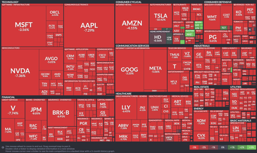

## Nein, Sie verwenden bitte keine Pie Charts!

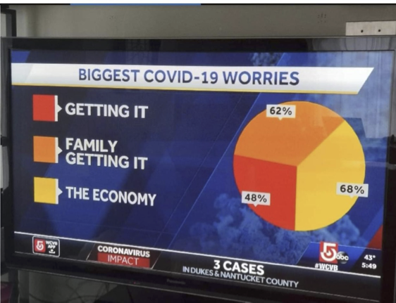

------------------------------------------------------------------------

# Sitzung 11: Data Storytelling & Dashboards

------------------------------------------------------------------------

## Die Lücke zwischen Daten und Entscheidung

> "Data scientists often suffer from the curse of knowledge. They know the data so well they forget that the audience doesn’t." — *Cole Nussbaumer Knaflic*

## Exploratory vs. Explanatory Analysis

Es gibt zwei Arten der Datenanalyse, die oft verwechselt werden:

1.  **Exploratory (Der Archäologe):**

-   Sie graben durch Datenberge.
-   Sie drehen jeden Stein um.
-   Sie erstellen 100 Charts, um 2 interessante zu finden.
-   **Ziel:** Verstehen, was passiert ist.

2.  **Explanatory (Der Journalist):**

-   Sie zeigen **nur** die 2 interessanten Charts (die Perlen).
-   Sie liefern Kontext und Handlungsempfehlungen.
-   **Ziel:** Jemand anderen zu einer Entscheidung bewegen.

## Der häufigste Fehler

Wir neigen dazu, dem Publikum den **gesamten Grabungsprozess** zu zeigen („Schaut mal, wie viel Arbeit ich mir gemacht habe!“).

**Das interessiert Stakeholder oft nicht.**

Das Management will wissen:

1.  Was ist das Problem?
2.  Warum ist es wichtig?
3.  Was sollen wir tun?

## Data Storytelling Dramaturgie

Datengeschichten folgen oft einer klassischen Dramaturgie:

1.  **Situation:** Der Status Quo (z.B. „Unser Traffic war stabil...“).
2.  **Komplikation:** Das Problem/Die Veränderung („...bis im Q3 ein Wettbewerber X tat“).
3.  **Lösung/Insight:** Die Erkenntnis aus den Daten („...unsere Analyse zeigt, dass wir Segment Y verlieren“).
4.  **Action:** Der Handlungsvorschlag („...deshalb müssen wir Budget auf Kanal Z schieben“).

## Kontext ist King

Zahlen allein bedeuten nichts.

-   „Wir haben 10.000 Visits.“ \rightarrow Gut oder schlecht?
-   „Wir haben 10.000 Visits, Ziel war 5.000.“ \rightarrow *\*Gut!\*\*
-   „Wir haben 10.000 Visits, letztes Jahr waren es 50.000.“ \rightarrow *\*Katastrophe!\*\*

**Regel:** Zeigen Sie niemals eine Metrik ohne Vergleichswert (Vorjahr, Ziel, Wettbewerb).

## Visual Storytelling mit R: Fokus lenken

Anstatt nur bunte Balken zu zeigen, nutzen wir Farbe strategisch, um die Aufmerksamkeit des Publikums zu lenken (Preattentive Attributes).

**Szenario:** Wir wollen zeigen, dass *Subaru* im Vergleich zu anderen Herstellern im Datensatz `mpg` besonders effizient auf dem Highway ist.

## Code: Fokus durch Farbe

```{r}
#| echo: true
#| fig-height: 4.5
library(ggplot2)
library(dplyr)

# Daten vorbereiten: Durchschnittliche mpg (miles per gallon) pro Hersteller
mpg_data <- mpg %>%
  group_by(manufacturer) %>%
  summarise(mean_hwy = mean(hwy)) %>%
  # Wir erstellen eine Highlight-Logik
  mutate(highlight = ifelse(manufacturer == "subaru", "yes", "no")) %>%
  arrange(mean_hwy) %>%
  mutate(manufacturer = factor(manufacturer, levels = manufacturer))

# Plot
ggplot(mpg_data, aes(x = manufacturer, y = mean_hwy, fill = highlight)) +
  geom_col() +
  coord_flip() +
  # Wir nutzen Farbe nur für die Story, nicht zur Dekoration!
  scale_fill_manual(values = c("yes" = "#B22222", "no" = "#DDDDDD"), guide = "none") +
  theme_minimal() +
  labs(
    title = "Subaru führt bei der Autobahn-Effizienz",
    subtitle = "Durchschnittliche Highway-Meilen pro Gallone (mpg)",
    x = NULL, y = "Highway Miles per Gallon"
  )

```

## Dashboards: Das Cockpit

Ein Dashboard ist **keine** Data Story. Ein Dashboard ist ein Überwachungsinstrument.

**Das Auto-Dashboard-Prinzip:**

-   Sie starren es nicht die ganze Zeit an.
-   Sie schauen kurz drauf, um zu sehen, ob alles okay ist.
-   Wenn eine Warnleuchte blinkt, brauchen Sie Details.

## Design-Prinzipien für Dashboards

1.  **Die 5-Sekunden-Regel:** Kann der Nutzer in 5 Sekunden sagen, ob er handeln muss?
2.  **Inverted Pyramid:**

-   **Oben:** Wichtigste KPIs (Big Numbers).
-   **Mitte:** Trends und Verläufe (Kontext).
-   **Unten:** Datentabellen und Details (Granularität).

3.  **F-Pattern:** Wir lesen von oben links nach rechts unten. Das Wichtigste gehört nach oben links!

## Bitte keine Tachos (Gauges)!

::::: columns
::: {.column width="50%"}
**Gauges sind Platzverschwendung:**

-   Sie verbrauchen viel Platz.
-   Sie zeigen oft nur eine einzige Zahl.
-   Sie sind schwer zu vergleichen.
:::

::: {.column width="50%"}
**Besser: Bullet Charts**

-   Zeigen Ist-Wert (Balken).
-   Zeigen Ziel-Wert (Strich).
-   Zeigen qualitative Bereiche (Hintergrund: schlecht/mittel/gut).
-   Brauchen extrem wenig Platz.
:::
:::::

## Bullet Chart Alternative (einfach)

```{r}
#| echo: false
#| fig-height: 3
library(ggplot2)

# Dummy Daten für ein Bullet Chart
df_bullet <- data.frame(
  metric = "Conversion Rate",
  current = 2.8,
  target = 3.5,
  range_bad = 2.0,    # Grenze für "Schlecht"
  range_good = 4.0    # Grenze für "Gut"
)

ggplot(df_bullet, aes(x = metric, y = current)) +
  # Hintergrundbereiche (Qualitative Ranges)
  geom_col(aes(y = range_good), fill = "#E0E0E0", width = 0.5) +
  geom_col(aes(y = range_bad), fill = "#A0A0A0", width = 0.5) +
  
  # Der eigentliche Wert (Bar) - schmaler als der Hintergrund
  geom_col(fill = "steelblue", width = 0.2) +
  
  # Das Ziel (Strich)
  geom_errorbar(aes(ymin = target, ymax = target), color = "red", width = 0.4, linewidth = 1.5) +
  
  coord_flip() +
  theme_minimal() +
  labs(title = "KPI Monitor: Conversion Rate vs. Target (Rot)", x = "", y = "%")

```

## Interaktivität in Dashboards

Wenn wir digitale Produkte bauen, erwarten Nutzer heute Interaktivität.

**Shneiderman’s Mantra der Visualisierung:**

1.  **Overview first**,
2.  **zoom and filter**,
3.  **then details-on-demand**.

*Lassen Sie den Nutzer nicht in Rohdaten ertrinken. Geben Sie ihm die Kontrolle über die Detailtiefe.*

## Übung: Das Dashboard-Konzept

Entwerfen Sie (auf Papier/Miro) ein Dashboard-Konzept für das digitale Produkt, das Sie in diesem Semester konzipiert haben.

1.  **Persona:** Wer ist der Nutzer des Dashboards? (CEO? Content Manager? Redakteur?)
2.  **KPIs:** Welche **3 Metriken** müssen ganz oben als "Big Numbers" stehen?
3.  **Action:** Welche Handlung soll ausgelöst werden, wenn eine Ampel auf "Rot" springt?

## Nächste Schritte

-   Überlegen Sie sich die "Story" für Ihre Abschlusspräsentation.
-   Bereiten Sie die Argumente vor: Welches Problem löst Ihr Produkt basierend auf welchen Daten?
-   **Nächste Sitzung:** Kritischer Umgang mit Daten, Ethik und KI.

------------------------------------------------------------------------

# Sitzung 12: Ethik, Recht & Critical Data Studies

## „Raw Data“ is an Oxymoron

> „Raw data is both an oxymoron and a bad idea; on the contrary, data should be cooked with care.“ — *Geoffrey C. Bowker*

**Die Kernbotschaft:** Daten sind niemals neutral. Sie sind immer das Ergebnis einer Entscheidung:

-   Was wurde gemessen?
-   Wer wurde gemessen?
-   Was wurde weggelassen?

## Critical Data Studies

**Drei Ebenen der Kritik:**

1.  **Datenbasis:** Wer fehlt in den Daten? (Invisible Data)
2.  **Algorithmus:** Verstärkt das Modell Vorurteile? (Algorithmic Bias)
3.  **Interface:** Manipulieren wir den Nutzer? (Dark Patterns)

## 1. Algorithmic Bias

Wenn wir KI mit historischen Daten trainieren, lernt die KI historische Vorurteile.

**Beispiel: Amazon Recruiting Engine (2018)**

-   Trainiert mit Lebensläufen der letzten 10 Jahre (meist Männer).
-   Die KI lernte: „Männer sind besser als Frauen“.
-   Folge: Lebensläufe mit dem Wort „women's“ (z.B. „women's chess club“) wurden abgewertet.
-   **Ergebnis:** Das Projekt wurde eingestampft.

## Bias in, Bias out

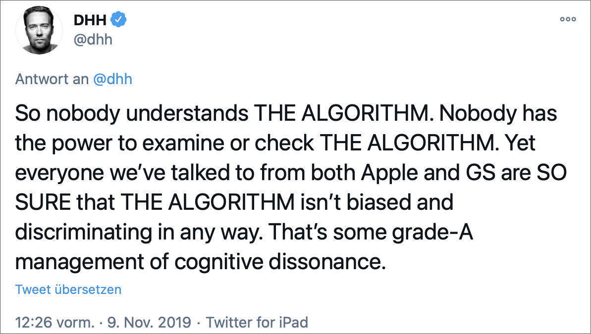

## Arten von Bias

-   **Selection Bias:** Die Daten repräsentieren nicht die Realität (siehe Sitzung 2).
-   **Historical Bias:** Die Welt war früher ungerechter als heute – Daten konservieren diesen Zustand.
-   **Labeling Bias:** Wer entscheidet, was „gut“ oder „schlecht“ ist? (Beispiel: Kriminologie-Daten).

## 2. Rechtliche Grundlagen (High Level)

Als Content-Manager sind Sie keine Juristen, aber Sie haften oft mit.

**DSGVO (GDPR) – Die Big 3 für uns:**

1.  **Recht auf Vergessenwerden:** Nutzer können Löschung verlangen. Sind Ihre Systeme bereit dafür?
2.  **Privacy by Design:** Datenschutz muss Voreinstellung sein, nicht Opt-in.
3.  **Zweckbindung:** Daten, die für den Newsletter gesammelt wurden, dürfen nicht einfach an Dritte verkauft werden.

## Die Cookie-Lüge (Consent Fatigue)

-   Haben Sie jemals *wirklich* die AGB gelesen?
-   **Consent Banner** sind oft so gestaltet, dass man entnervt auf „Alles akzeptieren“ klickt.
-   Rechtlich: Eine Einwilligung muss **freiwillig**, **informiert** und **eindeutig** sein.
-   Viele aktuelle Banner sind rechtlich in einer Grauzone.

## 3. Dark Patterns

**Definition:** User Interface Design, das Nutzer dazu bringt, Dinge zu tun, die sie eigentlich nicht tun wollten.

Abgrenzung zum **Nudging** (Sitzung 5):

-   *Nudging:* Hilft dem Nutzer (z.B. „Möchten Sie Apfel statt Schokolade?“).
-   *Dark Pattern:* Hilft nur dem Unternehmen (z.B. Versicherung unterjubeln).

## Dark Pattern Hall of Fame

1.  **Roach Motel:** Man kommt leicht rein, aber schwer wieder raus (z.B. Zeitungsabo kündigen nur per Fax).
2.  **Confirmshaming:** „Nein, ich möchte kein Geld sparen und dumm bleiben.“
3.  **Sneak into Basket:** Plötzlich liegt eine Reiseversicherung im Warenkorb.
4.  **Urgency:** „Nur noch 2 Zimmer verfügbar!“ (Oft fake).

## Beispiel: Confirmshaming

> **Popup:** "Möchten Sie unseren Newsletter mit Experten-Tipps?" \[ **JA, ICH WILL EXPERTE WERDEN** \] (Grüner, fetter Button) \[ Nein, ich mag schlechte Entscheidungen \] (Kleiner, grauer Text)

**Diskussion:** Ist das cleveres Marketing oder unethisch?

## 4. KI & Content Creation

Mit Generative AI (ChatGPT, Midjourney) entstehen neue Probleme:

-   **Urheberrecht:** Wem gehört ein Bild, das eine KI aus Millionen geklauten Bildern erstellt hat?
-   **Deepfakes:** Wenn wir Video und Audio nicht mehr trauen können – was bedeutet das für Markenvertrauen?
-   **Halluzinationen:** KI erfindet Fakten. Wer prüft das? (Stichwort: Brand Safety).

## Der EU AI Act

Das erste umfassende Gesetz zur Regulierung von KI.

-   **Risiko-basierter Ansatz:**
-   *Unannehmbares Risiko:* Social Scoring, manipulative KI -\> **Verboten**.
-   *Hochrisiko:* HR-Tools, Kreditvergabe -\> **Strenge Auflagen**.
-   *Geringes Risiko:* Chatbots, Spamfilter -\> **Transparenzpflicht** (User muss wissen, dass er mit einer Maschine spricht).

## Ethische Leitlinien für Ihr Projekt

Wenn Sie unsicher sind, nutzen Sie diese Tests:

1.  **Der Mom-Test:** Würde ich wollen, dass meine Mutter so getrackt/behandelt wird?
2.  **Der Front-Page-Test:** Wäre es mir peinlich, wenn meine Datennutzung auf der Titelseite der Zeitung steht?
3.  **Der Regret-Test:** Würde der Nutzer seine Entscheidung bereuen, wenn er wüsste, was wir wissen?

## Übung: The Evil Marketer

**Szenario:** Sie sollen für eine (fiktive) Firma "SugarRush" eine App konzipieren, die möglichst viel Süßigkeiten an Kinder verkauft.

**Aufgabe:** Entwickeln Sie (böse) Ideen:

1.  Welche Daten sammeln Sie?
2.  Welches Dark Pattern nutzen Sie?
3.  Wie nutzen Sie KI zur Manipulation?

*(Danach: Diskussion, wie man genau das verhindert)*

## Nächste Schritte

-   Prüfen Sie Ihr Konzept auf ethische Fallstricke.
-   Haben Sie Dark Patterns in Ihren Wireframes? Wenn ja: Entfernen!
-   **Nächste Sitzung:** Automatisierung, Personalisierung & Abschluss.

------------------------------------------------------------------------

# Sitzung 13: Automatisierung, Trends & Wrap-Up

## Das Problem der Skalierung

Wir haben jetzt:

1.  Daten analysiert & Zielgruppen segmentiert.
2.  Tolle Inhalte & Strategien entwickelt.
3.  Dashboards gebaut.

**Aber:** Wir können nicht jeden einzelnen Kunden manuell anschreiben und ihm das passende PDF schicken. **Lösung:** Automatisierung & Personalisierung.

## Von der Gießkanne zum PräzisionsgewehrFrüher (Mass Media):

-   Eine Botschaft an alle ("One size fits all").
-   Hoher Streuverlust.

Heute (Data-Driven Content):

-   **Right Content**
-   to the **Right Person**
-   at the **Right Time**
-   on the **Right Channel**.

Das geht nur durch Software.

## Marketing Automation

Automatisierung bedeutet nicht, dass ein Roboter Texte schreibt (noch nicht ganz). Es bedeutet, dass **Regelwerke** ausgeführt werden.

**Wenn** User X das Whitepaper herunterlädt, **Dann** warte 2 Tage **Und** schicke E-Mail Y.

**Wenn** E-Mail Y geöffnet wird, **Dann** informiere Sales-Team.

## Personalisierung vs. Customization\| Personalisierung \| Customization \|

| --- \| --- \|
| **System-gesteuert** \| **User-gesteuert** \|
| Wir nutzen Daten, um Inhalte anzupassen. \| Der User stellt sich sein Dashboard selbst ein. \|
| Bsp: Spotify "Dein Mix der Woche" \| Bsp: iPhone Homescreen Widgets \|
| "Wir wissen, was du willst." \| "Du sagst uns, was du willst." \|

## Die Personalisierungspyramide

1.  **Kosmetisch:** "Hallo *Vorname*!" (Basics)
2.  **Segment-basiert:** "Nutzer aus Hamburg sehen Regenjacken, Nutzer aus München sehen Badehosen."
3.  **Verhaltens-basiert:** "Weil du Artikel A, B und C gelesen hast, empfehlen wir D." (Netflix)
4.  **Prädiktiv (AI):** "Bevor du überhaupt suchst, wissen wir, dass du kündigen willst, und bieten dir einen Rabatt an." (Next Best Action).

## Predictive Analytics: Next Best Action

Wir nutzen historische Daten, um die **Wahrscheinlichkeit** einer Handlung vorherzusagen.

-   *Churn Score:* Wie wahrscheinlich ist es, dass der Kunde geht?
-   *Lead Score:* Wie wahrscheinlich ist es, dass er kauft?

**Content-Konsequenz:**

-   Hoher Churn Score \rightarrow Sende "Treue-Geschenk".
-   Hoher Lead Score \rightarrow Sende "Preisliste".

## Blick in die Zukunft: Synthetic Media

Wir bewegen uns von **Static Content** zu **Generative Content**.

-   **Heute:** Wir schreiben einen Artikel und hoffen, dass er passt.
-   **Morgen (GEO):** Eine KI generiert den Artikel *im Moment des Aufrufs* exakt für diesen einen Nutzer, basierend auf seinem Vorwissen und Kontext.

Die Rolle des "Content Creators" wandelt sich zum "Content Architect" (der die Regeln und Prompts definiert).

## Zusammenfassung des Semesters: Der rote Faden

Lassen Sie uns zurückblicken auf das, was wir gelernt haben.

## Der Golden Thread des Kurses

1.  **Mindset:** Daten sind nicht langweilig, sondern der Treibstoff für Relevanz.
2.  **Verstehen:** Wer ist die Zielgruppe? (Nicht raten, sondern messen/fragen).
3.  **Strategie:** Lean Content Canvas & Kanäle (Push vs. Pull).
4.  **Optimierung:** Testing (A/B) und Mining (Muster erkennen).
5.  **Kommunikation:** Visualisierung & Storytelling (Management überzeugen).
6.  **Verantwortung:** Ethik & Bias (Nicht böse sein).

## Schlusswort

> "Without data, you’re just another person with an opinion." — *W. Edwards Deming*

> "But data without a story is just a spreadsheet." — *Dieser Kurs*
